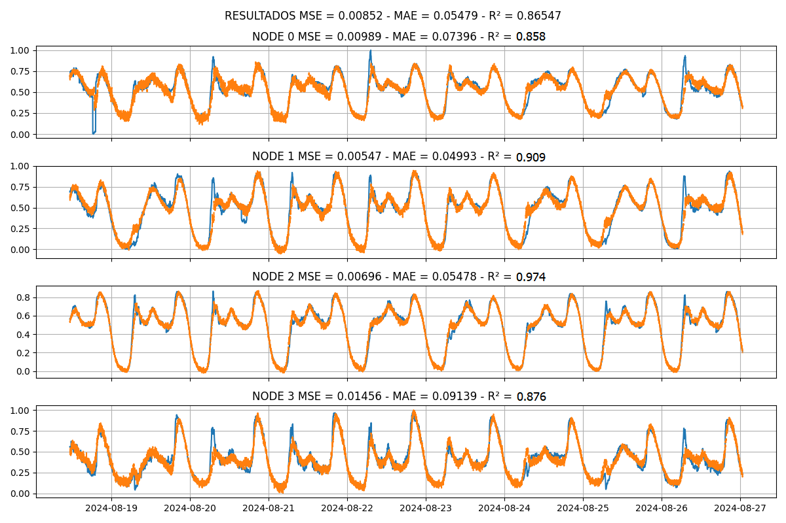

<div align="justify">

  # Integración del Algoritmo MPNN-LSTM en Modelos de Predicción de demanda y generacion para el MTE (Modelo Transaccional de Energía no Convencional de Múltiples Agentes) en el Departamento de Nariño
Este repositorio contiene modelos de generación y predicción de energía basados en redes neuronales de grafos (GNN), aplicados a datos eléctricos y ambientales de la ciudad de Pasto. Los enfoques implementados incluyen Message Passing Neural Network con LSTM (MPNNLSTM) y Graph Convolutional Network con LSTM (GCLSTM). La información empleada proviene de datos históricos de variables eléctricas (corrientes de línea, voltajes, potencia activa y reactiva) y ambientales (temperatura, radiación solar), con una malla de nodos geoespaciales optimizada para el análisis temporal y espacial. Se incluyen scripts para la limpieza, procesamiento y completado de datos, así como configuraciones optimizadas para predicciones a intervalos de 1 a 24 horas. Además, se aplicó una metodología de permutación de parámetros para identificar la mejor configuración en diferentes escenarios de predicción, evaluando horizontes temporales clave para aplicaciones prácticas como el despacho óptimo de energía y simulación de microrredes prosumidoras.

La base de datos construida integra información temporal, espacial y contextual para modelar la demanda eléctrica urbana. Los datos temporales provienen de tres fuentes principales:

- Consumo histórico de lámparas LED y de sodio de 24 circuitos (1,986 transformadores) entre enero 2018 y diciembre 2022, proporcionados por la empresa de alumbrado público.
- Series temporales de 152 medidores inteligentes (muestreo cada 15 minutos, enero 2020–junio 2023), incluyendo variables como potencia activa, corriente y voltaje por fase.
- Infraestructura eléctrica detallada (clientes conectados, estratos socioeconómicos, capacidad energética) y datos temporales de alta frecuencia (muestreo cada 1 minuto, junio 2024 a marzo 2025) de 20 circuitos.
  
La dimensión espacial se estructura mediante un Sistema de Información Geográfica (SIG) que combina capas de infraestructura eléctrica (transformadores, líneas de distribución, áreas de influencia de subestaciones) y características urbanas (zonas residenciales, comerciales, densidad poblacional). Los grafos se construyen definiendo nodos como centroides del área de influencia de cada circuito y aristas ponderadas inversamente a la distancia geográfica , formalizadas mediante w<sub>ij</sub> = exp(-β · d<sub>ij</sub>) ​donde d<sub>ij</sub> es la distancia euclidiana entre nodos y β un parámetro de sensibilidad espacial.

El módulo de aprendizaje automático propone un enfoque para desarrollar modelos que integren dependencias espacio-temporales en la predicción de demanda. Para ello, se entrenan modelos MPNNLSTM y GCLSTM, optimizando parámetros mediante búsqueda por permutación para horizontes de 1, 3, 6, 12 y 24 horas . Los resultados se comparan con un modelo base CNN-LSTM (solo datos temporales), validando la mejora estadística al incorporar la dimensión espacial. Los grafos se estructuran con una distancia fija de 2 km entre nodos únicamente para el caso de estudio de circuitos eléctricos, priorizando interacciones locales y reduciendo el ruido de conexiones distantes. En contraste, para los casos de estudio residencial, comercial y oficial, se exploraron radios variables de 250 m, 500 m y 750 m, diseñados para capturar relaciones entre clientes cercanos y distantes dentro de la red eléctrica. Para cada caso de estudio (residencial, comercial, oficial y circuitos), se entrenan modelos independientes, ajustando parámetros según las características específicas de los circuitos o usuarios asignados. Esta estrategia permite adaptar la complejidad del modelo a la heterogeneidad de la demanda, mejorando la precisión predictiva en escenarios con distintas escalas espaciales.

La metodología se limita a los casos de estudio mencionados debido a la baja representación de usuarios industriales en el área urbana. Aunque estos representan el 11% de la base de datos, sus ubicaciones dispersas dificultan la captura de relaciones espaciales significativas con los radios seleccionados (250 m–750 m). La estructura de grafos, con nodos centrados en áreas de influencia y conexiones ponderadas por proximidad geográfica, demostró ser clave para capturar correlaciones locales entre circuitos y subestaciones, posicionando a las GNNT como herramientas esenciales para mejorar la precisión en horizontes temporales variables y adaptarse a dinámicas de demanda no lineales.

<p align="center">
  
  <br>
  <em>Esquema de la metodología propuesta para incorporar información espacial al estudio de la demanda..</em>
</p>

# Introducción

Los grafos son una estructura de datos versátil y un lenguaje universal para describir sistemas complejos. En términos generales, un grafo es una colección de objetos (nodos) y las interacciones (aristas) entre pares de estos objetos. Esta estructura puede ser utilizada para modelar una gran variedad de sistemas en el mundo real, desde redes sociales hasta interacciones biológicas y sistemas de telecomunicaciones.

El poder de los grafos radica en su capacidad para representar relaciones entre entidades, en lugar de simplemente caracterizar a las entidades de manera aislada. Esta propiedad hace que los grafos sean ideales para trabajar con datos donde las conexiones o relaciones son tan importantes como los datos mismos. Por ejemplo, un grafo puede representar una red social con nodos que representan individuos y aristas que representan relaciones de amistad, o en el campo biológico, los nodos pueden representar proteínas y las aristas, interacciones entre ellas.

Lo interesante de los grafos es que no solo proporcionan un marco teórico elegante, sino que también ofrecen una base matemática sólida para analizar, comprender y aprender de sistemas complejos. En las últimas décadas, la disponibilidad de datos estructurados en forma de grafos ha aumentado exponencialmente, desde redes sociales a gran escala hasta bases de datos moleculares o dispositivos interconectados en la web. El desafío es aprovechar todo este potencial.

Aquí es donde entra el aprendizaje automático, una herramienta poderosa para analizar estos grafos y hacer predicciones. A medida que los conjuntos de datos crecen en tamaño y complejidad, el aprendizaje automático desempeña un papel crucial en modelar y entender las interacciones representadas en los grafos.

En este contexto, los grafos pueden ser creados y utilizados para modelar diferentes tipos de datos:

- Redes sociales: Nodos que representan personas y aristas que representan conexiones sociales. Los grafos permiten identificar comunidades, influencias o patrones de interacción dentro de una red.

- Biología: Nodos como proteínas o moléculas y aristas que representan interacciones biológicas, como reacciones químicas o interacciones proteína-proteína. Los grafos ayudan a predecir nuevas interacciones o a entender mejor procesos biológicos complejos.

- Redes de telecomunicaciones: Nodos que representan dispositivos o terminales, conectados por aristas que simbolizan enlaces de comunicación. Esto permite modelar la estructura de redes de telecomunicaciones y optimizar el flujo de datos o identificar fallos potenciales.

- Procesamiento de Lenguaje Natural (NLP): En NLP, los grafos pueden representar relaciones semánticas entre palabras, frases o documentos. Por ejemplo, los grafos de conocimiento estructuran la información de manera que facilita el análisis de texto, la generación de respuestas inteligentes o la predicción de significados basados en contexto.

- Visión por Computadora: Los grafos se aplican para analizar relaciones entre diferentes elementos de una imagen o video. Por ejemplo, en el reconocimiento de objetos, los nodos pueden representar regiones o píxeles, y las aristas modelan relaciones espaciales entre ellos, permitiendo un análisis más profundo de las imágenes.

- Data Mining: En minería de datos, los grafos son útiles para modelar patrones complejos en grandes volúmenes de datos. Pueden representar relaciones entre distintos tipos de datos, facilitando tareas como la detección de fraudes, la recomendación de productos o la identificación de patrones ocultos.

Cada uno de estos grafos puede utilizarse para realizar predicciones, como identificar comunidades dentro de una red social, predecir interacciones moleculares en biología o identificar fallos potenciales en una red de telecomunicaciones. Así, el aprendizaje automático sobre grafos ofrece una forma avanzada de entender y predecir comportamientos y relaciones en una amplia gama de aplicaciones.

# Contexto y Objetivos

El algoritmo MPNNLSTM combina dos potentes enfoques en el análisis de datos: la capacidad de los **Message Passing Neural Networks (MPNN)** para modelar relaciones complejas en grafos y la habilidad de las **Long Short-Term Memory (LSTM)** para capturar dependencias temporales. Este enfoque es ideal para analizar grafos temporales, donde no solo es importante entender las interacciones estructurales entre los nodos, sino también cómo estas interacciones cambian y evolucionan con el tiempo.

## Contexto: Neural Message Passing

Los Message Passing Neural Networks (MPNN) son un tipo de red neuronal diseñada específicamente para trabajar con datos estructurados en grafos. Durante cada iteración del paso de mensajes, cada nodo en el grafo actualiza su representación (embedding) en función de la información agregada de sus vecinos en el grafo. Esto permite capturar la estructura local del grafo y cómo las relaciones entre nodos impactan sus características.

Formalmente, en cada iteración del MPNN:

- Los nodos envían mensajes a sus vecinos.

- Estos mensajes son agregados usando una función que resume la información del vecindario.

- Luego, una función de actualización ajusta la representación de cada nodo utilizando tanto la información previamente almacenada como el mensaje recibido.

Al final del proceso de pasos de mensajes, cada nodo tendrá una representación enriquecida que refleja tanto sus propias características como las de sus vecinos. Este enfoque se utiliza para generar embeddings no solo para nodos individuales, sino también para subgrafos o incluso grafos completos.

*h*<sub>*u*</sub><sup>(*k* + 1)</sup> = UPDATE<sup>(*k*)</sup>(*h*<sub>*u*</sub><sup>(*k*)</sup>, AGGREGATE<sup>(*k*)</sup>({*h*<sub>*v*</sub><sup>(*k*)</sup> : ∀*v* ∈ *N*(*u*)}))
 = UPDATE<sup>(*k*)</sup>(*h*<sub>*u*</sub><sup>(*k*)</sup>, *m*<sub>*N*(*u*)</sub><sup>(*k*)</sup>)

*z*<sub>*u*</sub> = *h*<sub>*u*</sub><sup>(*K*)</sup>,  ∀*u* ∈ *V*

<p align="center">
  
  <br>
  <em>En una red neuronal de paso de mensajes, un nodo agrega información de sus vecinos, que a su vez también recopilan información de sus respectivos vecindarios. Esto crea una estructura en árbol   alrededor del nodo objetivo, reflejando la jerarquía de la propagación de mensajes en el grafo.</em>
</p>

## Contexto: LSTM para Captura Temporal

La arquitectura LSTM es una variación de las redes recurrentes, diseñada para capturar relaciones y patrones en secuencias temporales largas. En el contexto de los grafos temporales, el LSTM permite modelar cómo las representaciones de los nodos evolucionan a lo largo del tiempo. Esto es especialmente importante en situaciones donde la dinámica de las conexiones entre nodos cambia en función del tiempo o de eventos específicos.

## Objetivo del Algoritmo MPNNLSTM

El objetivo del algoritmo MPNNLSTM es combinar la capacidad de los MPNN para aprender representaciones estructurales de un grafo en un momento dado, con la habilidad del LSTM para capturar dependencias temporales en la evolución de los nodos y aristas a lo largo del tiempo. De esta manera, el modelo no solo aprende la estructura de un grafo estático, sino también cómo esta estructura cambia con el tiempo.

En esta implementación específica, el enfoque se aplica a la predicción de demanda eléctrica de diferentes tipos de clientes de una red eléctrica, donde se tienen en cuenta tanto las relaciones espaciales (distancias geográficas entre clientes) como las series temporales de consumo. Se crean grafos que representan las conexiones entre los clientes en función de su cercanía geográfica, y se utilizan estas conexiones para predecir el consumo futuro en diferentes horizontes temporales (1, 3, 6, 12 y 24 horas).

El modelo MPNNLSTM aprovecha esta representación temporal de los grafos para mejorar la precisión de las predicciones en comparación con modelos que solo consideran datos temporales, sin información espacial.

## Flujo del Algoritmo

- Construcción del grafo: Los nodos representan clientes de la red
  eléctrica y las aristas reflejan la cercanía geográfica entre ellos.

- Message Passing (MPNN): Se realiza una agregación de la información de
  los vecinos de cada nodo para generar una representación enriquecida
  del grafo.

- Captura temporal (LSTM): El modelo LSTM procesa las representaciones
  de los nodos a lo largo del tiempo para aprender la evolución temporal
  de las interacciones entre clientes.

- Predicción: Usando las representaciones aprendidas, se realizan
  predicciones sobre el consumo de energía futura en diferentes
  horizontes temporales.

El resultado es un modelo que no solo tiene en cuenta la estructura
espacial de los clientes, sino también las dinámicas temporales de sus
consumos energéticos.

# Desglose del Código

## Importación de Librerías

**Resumen Previo al Código:** Este bloque de código importa las bibliotecas necesarias para construir, manipular y evaluar grafos, así como para realizar cálculos y visualizar datos. Es una etapa de preparación esencial para cualquier proyecto que implique análisis de datos y redes neuronales.

**Código:**

``` python
import networkx as nx
import matplotlib.pyplot as plt 
import pandas as pd
from geopy.distance import great_circle
import numpy as np
import torch
import torch.nn.functional as F
from tqdm import tqdm
from torch_geometric_temporal.nn.recurrent import MPNNLSTM
from sklearn.metrics import mean_squared_error, mean_absolute_error, r2_score
import time
import csv
```

**Referencias a los Conceptos Clave:**

- **NetworkX**: Biblioteca para crear, manipular y estudiar la
  estructura, dinámica y funciones de grafos complejos.

- **Matplotlib**: Biblioteca de visualización en 2D para gráficos en
  Python.

- **Pandas**: Biblioteca poderosa para la manipulación y análisis de
  datos, especialmente en estructuras de datos como dataframes.

- **Geopy**: Utilizada para cálculos geoespaciales, como la distancia
  entre puntos geográficos.

- **NumPy**: Biblioteca fundamental para la computación científica en
  Python, proporciona soporte para matrices y operaciones matemáticas.

- **Torch**: Biblioteca de aprendizaje profundo que proporciona un
  enfoque flexible para la construcción de redes neuronales.

- **TQDM**: Proporciona barras de progreso en los bucles.

- **Torch Geometric Temporal**: Extensión de PyTorch Geometric para el
  modelado temporal de grafos.

- **Sklearn Metrics**: Biblioteca que proporciona herramientas para
  medir el rendimiento del modelo.

- **Time y CSV**: Utilizadas para la medición de tiempo y manipulación
  de archivos CSV, respectivamente.

**Posibles Variaciones o Parámetros Importantes:**

- **Visualización opcional**: Puedes optar por no importar
  ‘matplotlib.pyplot‘ si no necesitas visualizar el grafo.

- **Embeddings geoespaciales**: ‘geopy.distance‘ es clave para cualquier
  cálculo de distancia basado en coordenadas geográficas.

- **Selección de librerías**: Dependiendo de la complejidad del
  proyecto, podrías necesitar importar otras bibliotecas o módulos
  adicionales.

## Función de Secuencias

**Resumen Previo al Código:** Esta sección define una función que divide secuencias de características y etiquetas en ventanas de entrada y salida. La función permite trabajar con datos de series temporales, facilitando la preparación de los datos para el entrenamiento de modelos.

**Código:**

``` python
#%% FUNCION DE SECUENCIAS

def split_sequences(features, targets, n_steps_in, n_steps_out, n_sliding_steps, window_type):
    """
    Función para dividir secuencias de características y etiquetas en ventanas de entrada y salida.
    """
    # Inicializa las listas donde se almacenarán las secuencias de entrada (X) y salida (y)
    X, y = list(), list()  
    
    # Iterar a través de la secuencia utilizando pasos de tamaño 'n_sliding_steps'
    for i in range(0, len(features), n_sliding_steps):
        # Determina el índice final de la ventana de entrada
        end_ix = i + n_steps_in
        
        # Determina el índice final de la ventana de salida
        out_end_ix = end_ix + n_steps_out
        
        # Si los índices de entrada o salida superan la longitud de los datos, se detiene el ciclo
        if out_end_ix > len(features):
            break
        
        # Si el tipo de ventana es 'deslizante'
        if window_type == 'sliding':
            # Toma las secuencias de entrada y salida correspondientes a la ventana deslizante
            seq_x, seq_y = features[i:end_ix], targets[end_ix:out_end_ix]
        else:  # Si el tipo de ventana es 'expansiva'
            # La secuencia de entrada va desde el inicio hasta el índice final, pero siempre desde 0
            seq_x, seq_y = features[0:end_ix], targets[end_ix:out_end_ix]
        
        # Agrega la secuencia de entrada (seq_x) y salida (seq_y) a las listas
        X.append(seq_x)
        y.append(seq_y)
    
    # Devuelve las listas de secuencias de entrada y salida como arrays de NumPy
    return np.array(X), np.array(y)
```

**Desglose del Código:**

- `def split_sequences(...)`: Define la función que toma las
  características y etiquetas como entradas.

- `X, y = list(), list()`: Inicializa listas vacías para almacenar las
  secuencias de entrada y salida.

- `for i in range(0, len(features), n_sliding_steps)`: Itera sobre las
  características con un paso deslizante.

- `end_ix = i + n_steps_in`: Calcula el índice final de la ventana de
  entrada.

- `if out_end_ix > len(features)`: Verifica si los índices exceden la
  longitud de las características.

- `seq_x, seq_y = features[i:end_ix], targets[end_ix:out_end_ix]`:
  Extrae las secuencias de entrada y salida.

- `X.append(seq_x)`: Agrega la secuencia de entrada a la lista.

- `return np.array(X), np.array(y)`: Devuelve las secuencias de entrada
  y salida como arreglos de NumPy.

**Referencias a los Conceptos Clave:** La función `split_sequences` es esencial para preparar datos de series temporales en formato adecuado para modelos de aprendizaje automático. Esto permite trabajar con ventanas deslizantes para la predicción de valores futuros.

**Posibles Variaciones o Parámetros Importantes:**

- Se puede ajustar el tamaño de la ventana de entrada y salida cambiando
  `n_steps_in` y `n_steps_out`.

- El tipo de ventana puede ser modificado a ’expanding’ para incluir
  toda la secuencia hasta el índice actual.

- Cambiar el `n_sliding_steps` para definir la cantidad de solapamiento
  entre las ventanas de entrada.

## Función para Obtener Nodos Adyacentes

**Resumen Previo al Código:** Esta función se utiliza para identificar los nodos adyacentes a un nodo dado en una matriz de adyacencia, que es una representación de un grafo. Es fundamental para el análisis de grafos, donde la conectividad entre nodos es clave.

**Código:**

``` python
def get_adjacent_nodes(adj_matrix, node):
    """
    Función para obtener los nodos adyacentes a un nodo dado en una matriz de adyacencia.
    """
    adjacent_nodes = []  # Inicializa la lista que contendrá los nodos adyacentes

    # Itera sobre todos los nodos en la matriz de adyacencia
    for i in range(len(adj_matrix)):
        # Si hay una conexión entre el nodo dado y el nodo i (es decir, adj_matrix[node][i] == 1)
        if adj_matrix[node][i] == 1:
            adjacent_nodes.append(i)  # Agrega el nodo i a la lista de adyacentes
    
    return adjacent_nodes  # Devuelve la lista de nodos adyacentes
```

**Referencias a los Conceptos Clave:**

- **Matriz de Adyacencia**: Una representación en matriz de un grafo,
  donde los elementos indican la presencia de conexiones entre nodos.

- **Nodos y Aristas**: Conceptos fundamentales en teoría de grafos. Los
  nodos representan entidades y las aristas representan las conexiones
  entre ellos.

**Posibles Variaciones o Parámetros Importantes:**

- **Condición de Conexión**: Puedes modificar la condición
  "`adj_matrix[node][i]==1`" para adaptarse a diferentes tipos de grafos
  (ponderados, no dirigidos, etc.).

- **Estructura de Datos**: En lugar de listas, se podrían usar otras
  estructuras de datos como conjuntos o diccionarios para almacenar
  nodos adyacentes, dependiendo de los requisitos del análisis.

## Función para Calcular Distancia Geográfica

**Resumen Previo al Código:** Esta función calcula la distancia en
kilómetros entre dos coordenadas geográficas utilizando la fórmula del
círculo máximo, también conocida como la fórmula de Haversine. Es útil
para aplicaciones geoespaciales donde la distancia entre dos puntos es
relevante.

**Código:**

``` python
def calcular_distancia(coord1, coord2):
    """
    Calcula la distancia en kilómetros entre dos coordenadas geográficas usando la fórmula 
    del círculo máximo.
    """
    return great_circle(coord1, coord2).kilometers  # Calcula la distancia usando la fórmula del círculo máximo
```

**Referencias a los Conceptos Clave:**

- **Fórmula del Círculo Máximo (Haversine)**: Utilizada para calcular la
  distancia entre dos puntos en la superficie de una esfera, dados sus
  latitudes y longitudes.

- **Geopy**: Biblioteca de Python que facilita el uso de servicios y
  cálculos geoespaciales.

- **Coordenadas Geográficas**: Un par de valores (latitud y longitud)
  que definen un punto en la superficie de la Tierra.

**Posibles Variaciones o Parámetros Importantes:**

- **Unidades de medida**: Aunque el código retorna la distancia en
  kilómetros, podrías modificarlo para retornar la distancia en millas
  si es necesario.

- **Métodos alternativos**: Además de ‘great_circle‘, Geopy ofrece otros
  métodos como ‘distance.distance‘ que pueden ser utilizados dependiendo
  de la precisión y requerimientos específicos.

## Lectura de Datos y Creación de Diccionario de Métricas

**Resumen Previo al Código:** Esta sección de código se encarga de leer
un archivo CSV que contiene las ubicaciones de los nodos y de crear un
diccionario para almacenar las métricas del modelo entrenado. Es una
parte esencial para preparar los datos y guardar los resultados del
entrenamiento.

**Código:**

``` python
# Lee los datos de entrada con las ubicaciones de los nodos
df = pd.read_csv(r'./DATOS/ubicaciones.csv')
# Crear el diccionario para almacenar las metricas del modelo entrenado
datos_modelo = {
    "NAME MODEL": [],
    "MSE": [],
    "MAE": [],
    "R2": [],
    "TIME": []}
```

**Referencias a los Conceptos Clave:**

- **Pandas read_csv**: Función de Pandas utilizada para leer un archivo
  CSV y almacenarlo en un dataframe.

- **DataFrame**: Estructura de datos bidimensional en Pandas, similar a
  una tabla de base de datos o una hoja de cálculo.

- **Diccionario en Python**: Estructura de datos que almacena pares
  clave-valor. Aquí, se utiliza para almacenar las métricas del modelo.

- **Métricas de evaluación**: Valores utilizados para evaluar el
  rendimiento del modelo, tales como MSE (Error Cuadrático Medio), MAE
  (Error Absoluto Medio) y R2 (Coeficiente de Determinación).

**Posibles Variaciones o Parámetros Importantes:**

- **Ruta del archivo CSV**: Asegúrate de que la ruta al archivo CSV es
  correcta y el archivo existe en esa ubicación.

- **Columnas adicionales en datos_modelo**: Puedes agregar más métricas
  o modificar las existentes según las necesidades de tu evaluación.

- **Validación de datos**: Considera agregar pasos para validar los
  datos leídos del archivo CSV para garantizar que estén en el formato
  correcto.

## Definición de Radio de Proximidad y Creación de Grafo

**Resumen Previo al Código:** Esta sección de código define un radio de
proximidad y crea un grafo utilizando NetworkX. Los nodos del grafo se
añaden a partir de las ubicaciones leídas de un DataFrame, y se asignan
colores a nodos específicos.

**Código:**

``` python
# Definir el radio de proximidad
rad_prox = 0.25

# Crear un grafo vacío utilizando NetworkX
G = nx.Graph()

# Iterar sobre las filas de un DataFrame 'df'
for i, ubi in df.iterrows():
    # Agregar nodos al grafo 'G' con la información de latitud y longitud de cada fila del DataFrame
    G.add_node("Nodo" + str(i), latitud=ubi[1], longitud=ubi[2])

# Establecer el color de nodos especiales (nodos con índices 92, 93, 95, 96)
for i in [92, 93, 95, 96]:
    G.nodes["Nodo" + str(i)]["color"] = "red"  # Asignar color rojo a los nodos especiales

# Establecer el color de los nodos que no tienen un color definido
for node in G.nodes:
    if "color" not in G.nodes[node]:
        G.nodes[node]["color"] = "skyblue"  # Asignar color 'skyblue' por defecto a los nodos restantes
```

**Referencias a los Conceptos Clave:**

- **NetworkX**: Biblioteca para la creación y manipulación de grafos
  complejos.

- **DataFrame de Pandas**: Estructura de datos que permite almacenar y
  manipular datos tabulares.

- **Nodo**: Entidad fundamental en un grafo que representa un punto o
  vértice.

- **Radio de Proximidad**: Parámetro que define la distancia máxima para
  considerar dos nodos como adyacentes.

**Posibles Variaciones o Parámetros Importantes:**

- **radio de proximidad**: Puedes ajustar el valor de ‘rad_prox‘ según
  los requisitos de proximidad de tu aplicación.

- **Color de los nodos**: Puedes cambiar los colores asignados a los
  nodos especiales o predeterminados para visualizar diferentes
  características.

- **Criterio de selección de nodos especiales**: Los índices de nodos
  especiales (92, 93, 95, 96) pueden ser modificados según otros
  criterios relevantes.

## Construcción de Conexiones en el Grafo

**Resumen Previo al Código:** En esta sección se itera sobre todos los pares de nodos en un grafo para calcular la distancia entre ellos utilizando sus coordenadas de latitud y longitud. Se agregan aristas entre nodos si la distancia es menor o igual a un radio de proximidad definido. Además, se crean conexiones específicas entre ciertos nodos.

**Código:**

``` python
# Iterar sobre todos los pares de nodos en el grafo G
for nodo1 in G.nodes:    
    for nodo2 in G.nodes:
        if nodo1 != nodo2:  # Asegurarse de no calcular la distancia entre el mismo nodo
            # Calcular la distancia entre nodo1 y nodo2 usando las coordenadas de latitud y longitud
            distancia = calcular_distancia((G.nodes[nodo1]["latitud"], G.nodes[nodo1]["longitud"]),
                                           (G.nodes[nodo2]["latitud"], G.nodes[nodo2]["longitud"]))
            # Si la distancia es menor o igual al radio de proximidad, agregar una arista
            if distancia <= rad_prox:
                G.add_edge(nodo1, nodo2, distancia=distancia)  # Añadir la arista al grafo con la distancia como atributo

# Crear conexiones específicas entre los nodos 92, 93, 95 y 96
for nodo1 in ['Nodo92', 'Nodo93', 'Nodo95', 'Nodo96']:
    for nodo2 in ['Nodo92', 'Nodo93', 'Nodo95', 'Nodo96']:
        if nodo1 != nodo2:  # Evitar conectar un nodo consigo mismo
            # Calcular la distancia entre los nodos específicos
            distancia = calcular_distancia((G.nodes[nodo1]["latitud"], G.nodes[nodo1]["longitud"]),
                                           (G.nodes[nodo2]["latitud"], G.nodes[nodo2]["longitud"]))            
            G.add_edge(nodo1, nodo2, distancia=distancia)  # Agregar una arista entre los nodos con la distancia
```

**Desglose del Código:**

- `for nodo1 in G.nodes`: Itera sobre todos los nodos en el grafo *G*.

- `if nodo1 != nodo2`: Asegura que no se calcule la distancia entre el
  mismo nodo.

- `distancia = calcular_distancia(...)`: Llama a la función para
  calcular la distancia entre los nodos utilizando sus coordenadas.

- `if distancia <= rad_prox`: Verifica si la distancia está dentro del
  radio de proximidad.

- `G.add_edge(nodo1, nodo2, distancia=distancia)`: Agrega una arista al
  grafo con la distancia como atributo.

- Se repite un proceso similar para los nodos específicos (’Nodo92’,
  ’Nodo93’, ’Nodo95’, ’Nodo96’).

**Referencias a los Conceptos Clave:** La construcción de conexiones en un grafo es fundamental para representar relaciones entre nodos. En este caso, la distancia entre nodos se utiliza para determinar si deben estar conectados, lo que puede ser crucial para análisis posteriores.

**Posibles Variaciones o Parámetros Importantes:**

- `rad_prox`: Ajustar este valor cambia el rango dentro del cual se permiten conexiones entre nodos.

- Se pueden incluir más nodos o cambiar las coordenadas para experimentar con la densidad del grafo.

- La función `calcular_distancia` puede ser modificada para incluir diferentes métricas de distancia si es necesario.

<p align="center">
  
  <br>
  <em>Estructura de grafo de tres casos de estudio. De izquierda a derecha: radios de 250 m, 500 m y 750 m. De arriba abajo: Caso Comercial, Caso Residencial y Caso Oficial</em>
</p>

## Conversión de Grafo a Matriz de Adyacencia y Configuración de Visualización

**Código:** Esta sección convierte un grafo en una matriz de adyacencia utilizando NumPy y luego crea un DataFrame para facilitar la visualización de la matriz. Además, configura las opciones de visualización de Pandas para mostrar todas las filas y columnas del DataFrame.

**Código:**

``` python
# Convierte el grafo G en una matriz de adyacencia en forma de array de NumPy
adjacency_matrix = nx.to_numpy_array(G)
# Crea un DataFrame a partir de la matriz de adyacencia para una visualización más sencilla
df2 = pd.DataFrame(adjacency_matrix)
# Configura las opciones de visualización de pandas para mostrar todas las filas y columnas
pd.set_option('display.max_rows', None)     # Mostrar todas las filas
pd.set_option('display.max_columns', None)  # Mostrar todas las columnas
```

**Referencias a los Conceptos Clave:**

- **NetworkX to_numpy_array**: Función que convierte un grafo de
  NetworkX en una matriz de adyacencia en formato NumPy.

- **DataFrame de Pandas**: Estructura de datos que permite almacenar y
  manipular datos tabulares, facilitando su visualización y análisis.

- **Matriz de Adyacencia**: Representación en matriz de un grafo donde
  los elementos indican la presencia de conexiones entre nodos.

- **Opciones de Visualización de Pandas**: Configuración para mostrar
  todas las filas y columnas de un DataFrame, útil para inspeccionar
  grandes conjuntos de datos.

**Posibles Variaciones o Parámetros Importantes:**

- **Visualización Condicional**: Ajustar las opciones de visualización
  basadas en el tamaño del DataFrame para evitar sobrecargar la salida.

- **Métodos Alternativos**: Utilizar otras funciones de conversión de
  NetworkX o métodos de visualización para diferentes requerimientos de
  análisis.

- **Exportación a CSV**: Después de crear el DataFrame, considera
  exportarlo a un archivo CSV para su uso posterior.

## Cálculo de Aristas y Filtrado de Nodos en el Grafo

**Resumen Previo al Código:** Esta sección de código cuenta el número de aristas en un grafo, obtiene los nodos adyacentes a nodos de interés, elimina nodos sin información relevante según un radio de proximidad, y filtra nodos duplicados antes de ajustar el grafo final.

**Código:**

``` python
# Cuenta el número de aristas en el grafo (elementos no nulos)
num_edges = np.sum(adjacency_matrix) // 2  # Se divide por 2 porque el grafo es no dirigido
node_val = []  # Inicializa una lista vacía para almacenar los nodos adyacentes

# Obtenemos los nodos conectados a los nodos de interés (92, 93, 95, 96)
for i in [92, 93, 95, 96]:
    # Llama a la función 'get_adjacent_nodes' para obtener los nodos adyacentes al nodo i
    adjacent_nodes = get_adjacent_nodes(df2, i)
    
    # Imprime los nodos adyacentes al nodo i
    print(adjacent_nodes)
    
    # Agrega los nodos adyacentes al arreglo 'node_val'
    node_val = np.append(node_val, adjacent_nodes) 
#%% ELIMINAR NODOS SIN INFORMACIÓN

# Define los nodos a eliminar según el valor de 'rad_prox'
if rad_prox == 0.25:
    val_del = [61, 62]  # Nodos a eliminar para R=0.25

if rad_prox == 0.5:
    val_del = [61, 62, 0, 3, 16]  # Nodos a eliminar para R=0.5
    
if rad_prox == 0.75:
    val_del = [61, 62, 0, 3, 16, 66, 65, 73, 45, 8, 97]  # Nodos a eliminar para R=0.75

# Verificar si alguno de los nodos en 'val_del' está presente en 'node_val'
if any(val in node_val for val in val_del):
    # Si es así, eliminar los nodos en 'val_del' de 'node_val'
    for val in val_del:
        node_val = np.delete(node_val, np.where(node_val == val))
#%% ELIMINA VALORES REPETIDOS
# Elimina los valores duplicados en 'node_val' y guarda el resultado
node_val = np.unique(node_val)

# Imprime el número total de nodos en el grafo G
print('Nodos totales: ', len(G.nodes))

# Recorre todos los nodos del grafo G
for i in range(len(G.nodes)):
    # Si el nodo 'i' está en 'node_val', se mantiene
    if i in node_val:
        pass  # No se hace nada si el nodo está en 'node_val'
    else:
        # Si el nodo 'i' no está en 'node_val', se elimina del grafo G
        G.remove_node('Nodo' + str(i))

# Convierte 'node_val' a tipo entero de 64 bits
node_val = node_val.astype(np.int64)

# Imprime los nodos restantes en 'node_val'
print(node_val)
```

**Referencias a los Conceptos Clave:**

- **Número de aristas**: Conteo de las conexiones entre nodos en un
  grafo no dirigido.

- **Función get_adjacent_nodes**: Función utilizada para obtener los
  nodos adyacentes a un nodo específico.

- **Radio de Proximidad**: Parámetro que determina la eliminación de
  nodos basados en su cercanía.

- **Eliminación de Duplicados**: Uso de ‘np.unique‘ para eliminar
  valores duplicados de un array.

- **Filtrado de Nodos**: Proceso de mantener o eliminar nodos en el
  grafo basado en su relevancia.

**Posibles Variaciones o Parámetros Importantes:**

- **Radio de Proximidad**: Ajuste del valor de ‘rad_prox‘ para cambiar
  los criterios de eliminación de nodos.

- **Nodos de Interés**: Modificación de la lista de nodos de interés
  (‘\[92, 93, 95, 96\]‘) para enfocarse en diferentes nodos.

## Conversión y Visualización de la Matriz de Adyacencia

**Resumen Previo al Código:** Esta sección convierte un grafo en una matriz de adyacencia, configura las opciones de visualización de Pandas para mostrar todas las filas y columnas, y grafica la matriz de adyacencia utilizando Matplotlib para facilitar la inspección y análisis visual.

**Código:**

``` python
# Obtiene la matriz de adyacencia en forma de numpy array
adjacency_matrix = nx.to_numpy_array(G)

# Convierte la matriz de adyacencia en un DataFrame de pandas
df2 = pd.DataFrame(adjacency_matrix)

# Configura las opciones de visualización de pandas para mostrar todas las filas y columnas
pd.set_option('display.max_rows', None)  # Muestra todas las filas
pd.set_option('display.max_columns', None)  # Muestra todas las columnas

# Imprime la matriz de adyacencia como un DataFrame
print(df2)

#%% MATRIZ DISPERSA
# Graficar la matriz dispersa
plt.figure(figsize=(4, 4))
plt.spy(adjacency_matrix, markersize=10, aspect='auto')
plt.grid(True)
# Configurar las marcas en los ejes X e Y cada 1 unidad
plt.xticks(np.arange(0, len(adjacency_matrix), 1))
plt.yticks(np.arange(0, len(adjacency_matrix), 1))
# Eliminar los números de los ejes
plt.gca().set_xticklabels([])
plt.gca().set_yticklabels([])
# Activar la cuadrícula con líneas cada 1 unidad
plt.grid(True, which='both', linestyle='--', linewidth=0.5)
plt.show()
```

**Referencias a los Conceptos Clave:**

- **Matriz de Adyacencia**: Representación en matriz de un grafo donde
  los elementos indican la presencia de conexiones entre nodos.

- **DataFrame de Pandas**: Estructura de datos que permite almacenar y
  manipular datos tabulares, facilitando su visualización y análisis.

- **Visualización de Matrices Dispersas**: Uso de ‘plt.spy‘ en
  Matplotlib para visualizar matrices dispersas, lo que ayuda a
  identificar patrones y conexiones en el grafo.

- **Configuración de Pandas**: Opciones de Pandas para mostrar todas las
  filas y columnas en el DataFrame, útil para inspeccionar grandes
  conjuntos de datos.

**Posibles Variaciones o Parámetros Importantes:**

- **Ajustes de Visualización**: Cambiar el tamaño de la figura o los
  parámetros de ‘markersize‘ y ‘aspect‘ en ‘plt.spy‘ para mejorar la
  visualización.

- **Filtrado de Datos**: Aplicar filtros al DataFrame antes de la
  visualización para centrarse en partes específicas del grafo.

- **Exportación de la Matriz**: Considerar la exportación de la matriz
  de adyacencia a otros formatos, como CSV, para su uso posterior.

<p align="center">
  
  <br>
  <em>Matrices de abyacencia de nueve estructuras de grafos generadas para el estudio. De izquierda a derecha: radios de 250 m, 500 m y 750 m. De arriba abajo: Caso Comercial, Caso Residencial y Caso Oficial.</em>
</p>

## Inicialización de Diccionario y Almacenamiento de Ubicaciones

**Resumen Previo al Código:** Esta sección de código inicializa un diccionario para almacenar latitudes y longitudes de nodos seleccionados. Luego, itera sobre las filas de un DataFrame para agregar las coordenadas de los nodos que están en la lista ‘node_val‘.

**Código:**

``` python
# Inicializa un diccionario para almacenar ubicaciones
ubicaciones = {
    'LATITUD': [],  # Lista para almacenar las latitudes
    'LONGITUD': []  # Lista para almacenar las longitudes
}

# Itera sobre las filas del DataFrame df
for i, a in df.iterrows():    
    if i in node_val:  # Comprueba si el índice está en node_val
        a = df.iloc[i]  # Obtiene la fila correspondiente al índice i
        # Añade la latitud y longitud a las listas del diccionario
        ubicaciones['LATITUD'].append(a[1])  # La latitud está en la segunda columna
        ubicaciones['LONGITUD'].append(a[2])  # La longitud está en la tercera columna
```

**Referencias a los Conceptos Clave:**

- **Diccionario en Python**: Estructura de datos que almacena pares clave-valor, útil para organizar datos relacionados.

- **DataFrame de Pandas**: Estructura de datos que permite almacenar y manipular datos tabulares, facilitando la iteración y acceso a datos específicos.

- **Iteración sobre DataFrame**: Uso de ‘iterrows‘ para recorrer cada fila en un DataFrame, permitiendo operaciones basadas en condiciones.

**Posibles Variaciones o Parámetros Importantes:**

- **Validación de Datos**: Agregar verificaciones adicionales para
  asegurar que las coordenadas sean válidas antes de agregarlas al
  diccionario.

- **Columnas Personalizadas**: Ajustar los índices de columna (‘a\[1\]‘,
  ‘a\[2\]‘) según el esquema específico de tu DataFrame.

- **Filtrado de Nodos**: Considerar otros criterios para filtrar nodos
  relevantes antes de agregarlos al diccionario.

## Obtención de la Matriz de Índices de Bordes en Formato COO

**Resumen Previo al Código:** Esta sección obtiene la matriz de índices de bordes en formato COO (Coordinate List) de una matriz de adyacencia, convirtiendo las coordenadas de las aristas en un tensor de PyTorch para su posterior uso en modelos de grafos.

**Código:**

``` python
# OBTENER LA MATRIZ DE INDICES DE BORDES EN FORMATO COO
# Se inicializan listas para almacenar las coordenadas de los elementos con valor 
# 1 en la matriz de adyacencia
aux1 = []  # Almacena las coordenadas i (filas) de los elementos con valor 1
aux2 = []  # Almacena las coordenadas j (columnas) de los elementos con valor 1

# Se itera sobre la matriz df2 (matriz de adyacencia)
for i in range(len(df2)):
    for j in range(len(df2)):
        # Verificar si el elemento en la posición (i, j) es igual a 1 (es decir, 
        #hay una arista entre los nodos)
        if df2.iloc[i, j] == 1:
            aux1.append(i)  # Almacenar la coordenada i (fila) en la lista aux1
            aux2.append(j)  # Almacenar la coordenada j (columna) en la lista aux2

# Convertir las listas auxiliares a arreglos de numpy
aux1 = np.array(aux1)  # Convierte aux1 a un arreglo de numpy
aux2 = np.array(aux2)  # Convierte aux2 a un arreglo de numpy

# Apilar los arreglos verticalmente para formar una matriz de coordenadas (edge_index)
aux3 = np.vstack((aux1, aux2))  # Crea un arreglo 2D donde cada columna representa un borde

# Convertir la matriz de coordenadas a un tensor de PyTorch y especificar el tipo de dato
edge_index = torch.tensor(aux3)  # Convierte aux3 a un tensor de PyTorch
edge_index = edge_index.to(torch.int64)  # Asegura que el tensor sea del tipo int64
edge_index = edge_index.to(device)  # Mueve el tensor al dispositivo adecuado (GPU o CPU)

# Imprimir el tensor de índices de bordes
print(edge_index)
```

**Referencias a los Conceptos Clave:**

- **Formato COO (Coordinate List)**: Representación de matrices
  dispersas que almacena solo las coordenadas de los elementos no nulos.

- **Matriz de Adyacencia**: Representación en matriz de un grafo donde
  los elementos indican la presencia de conexiones entre nodos.

- **Tensor de PyTorch**: Estructura de datos fundamental en PyTorch,
  utilizada para el cálculo eficiente en GPU y CPU.

- **Dispositivo (device) en PyTorch**: Especifica el uso de GPU o CPU
  para el almacenamiento y cálculo de tensores.

**Posibles Variaciones o Parámetros Importantes:**

- **Matriz de Adyacencia**: Considera diferentes métodos de creación y
  manipulación de matrices de adyacencia según el contexto del grafo.

- **Ajustes de Conversión**: Verifica que las conversiones a NumPy y
  tensores de PyTorch se realicen correctamente, especialmente para
  grandes grafos.

- **Optimización de Iteración**: Para grandes matrices, considera
  optimizar la iteración para mejorar el rendimiento.

## Obtención de Distancias entre Nodos del Grafo

**Resumen Previo al Código:** Esta sección de código calcula las distancias entre los nodos del grafo utilizando sus coordenadas geográficas. Las distancias se almacenan en una lista para su posterior análisis o uso.

**Código:**

``` python
# OBTIENE DISTANCIAS ENTRE NODOS DEL GRAFO FINAL

dist = []  # Lista para almacenar las distancias entre nodos

# Iterar sobre los índices de los bordes almacenados en aux3
for ij in range(len(aux3[0])):  
    # Calcular la distancia entre el nodo inicial y el nodo final usando las coordenadas de ubicación
    distancia = calcular_distancia(
        (ubicaciones['LATITUD'][aux3[0][ij]], ubicaciones['LONGITUD'][aux3[0][ij]]),  # Coordenadas del nodo inicial
        (ubicaciones['LATITUD'][aux3[1][ij]], ubicaciones['LONGITUD'][aux3[1][ij]])   # Coordenadas del nodo final
    ) 
    dist.append(distancia)  # Almacenar la distancia calculada en la lista
    # print(distancia)  # Descomentar para imprimir cada distancia calculada
```

**Referencias a los Conceptos Clave:**

- **Distancia Geográfica**: Medición de la distancia entre dos puntos en
  la superficie de la Tierra utilizando sus coordenadas de latitud y
  longitud.

- **Listas en Python**: Estructura de datos que almacena una secuencia
  ordenada de elementos, en este caso, las distancias.

- **Función calcular_distancia**: Función previamente definida para
  calcular la distancia entre dos coordenadas geográficas.

- **Iteración sobre Índices**: Proceso de recorrer los índices de un
  arreglo para realizar operaciones sobre los elementos
  correspondientes.

**Posibles Variaciones o Parámetros Importantes:**

- **Filtro de Distancias**: Considerar filtros adicionales para
  almacenar solo distancias relevantes o dentro de un rango específico.

- **Optimización de Iteración**: Para grandes grafos, optimizar el
  proceso de iteración para mejorar el rendimiento.

- **Impresión de Resultados**: Descomentar la línea de
  ‘print(distancia)‘ para imprimir cada distancia calculada durante la
  iteración.

## Obtención de Atributos de Borde

**Resumen Previo al Código:** Esta sección obtiene los atributos de los bordes en el grafo, inicializando un arreglo con unos. Alternativamente, si se descomentan ciertas líneas y se comenta otra, los atributos de los bordes representarán la distancia inversa entre nodos.

**Código:**

``` python
# OBTENER ATRIBUTOS DE BORDE

# Se inicializa un arreglo con unos para representar un atributo de borde
aux1 = np.ones(len(dist))  # Crear un arreglo de unos con la misma longitud que la lista de distancias

# Se convierten los atributos a un tensor de PyTorch
# dist_array = np.array(dist) # Convierte la lista dist a un arreglo
# aux1 = 1 / dist_array # Calcula el inverso de la distancia
ed_at = torch.tensor(aux1)  # Convertir aux1 a un tensor de PyTorch
edge_attr = ed_at.to(torch.float32)  # Convertir el tensor a tipo float32
edge_attr = edge_attr.to(device)  # Mover el tensor al dispositivo adecuado (GPU o CPU)

# Imprimir el tensor de atributos de borde
print(edge_attr)
```

**Referencias a los Conceptos Clave:**

- **Atributos de Borde**: Valores asociados a las aristas del grafo que
  pueden representar distancias, pesos, etc.

- **Tensor de PyTorch**: Estructura de datos fundamental en PyTorch,
  utilizada para el cálculo eficiente en GPU y CPU.

- **Conversión a Tensores**: Proceso de convertir arreglos de NumPy a
  tensores de PyTorch para operaciones más eficientes.

- **Inverso de la Distancia**: Un cálculo alternativo donde el atributo
  de borde representa la inversa de la distancia entre nodos.

**Posibles Variaciones o Parámetros Importantes:**

- Descomentar las siguientes líneas para usar la distancia inversa como
  atributos de borde:

          # dist_array = np.array(dist) # Convierte la lista dist a un arreglo
          # aux1 = 1 / dist_array # Calcula el inverso de la distancia

- Comentar la siguiente línea:

          ed_at = torch.tensor(aux1)  # Convertir aux1 a un tensor de PyTorch

- **Atributos Personalizados**: Puedes personalizar los atributos de
  borde según las necesidades de tu modelo, como usar la inversa de la
  distancia.

- **Ajustes en el Tensor**: Verifica que las conversiones y tipos de
  datos en los tensores se ajusten a los requisitos específicos del
  modelo.

- **Uso de GPU o CPU**: Asegúrate de que los tensores se muevan al
  dispositivo adecuado (‘device‘) para optimizar el rendimiento de las
  operaciones.

## Selección de Nodos en Base de Datos

**Resumen Previo al Código:** En esta sección se seleccionan nodos específicos de un conjunto de datos almacenado en un archivo CSV. Se inicializan índices para seleccionar un rango de filas y se crean listas de columnas que incluyen una columna de fecha y las correspondientes a los nodos seleccionados. Después de la lectura del archivo, se realiza una copia del DataFrame para análisis posterior.

**Código:**

``` python
#%% SELECCIÓN DE NODOS EN BASE DE DATOS
'''
UNIV. COOPERATIVA - NODO 92
UNIVERSIDAD MARIANA - NODO 93
UNV. DE NARIÑO - TOROBAJO - NODO 95
UNV. DE NARIÑO - VIPRI - NODO 96
'''

# Inicialización de índices para seleccionar filas
ini = 4 * 24 * 30 * 13 * 2  # El índice inicial para la selección de filas
inter = -1  # El índice final para la selección de filas (usando -1 selecciona hasta el final)

# Lista de columnas seleccionadas, comenzando con 'fecha_hora'
columnas_seleccionadas = ['fecha_hora']

# Agregar los nodos seleccionados a la lista de columnas
for i in node_val:
    columnas_seleccionadas.append('NODO' + str(i))

# Lee el archivo CSV y selecciona solo las filas indicadas y las columnas especificadas
n41m_df = pd.read_csv(r'./DATOS/NODOS_MAPA_UNIVER.csv', usecols=columnas_seleccionadas).iloc[ini:inter]

# Hacer una copia del DataFrame para el análisis posterior
n4_pot_act = n41m_df.copy()

# Eliminar la columna 'fecha_hora' para quedarnos solo con los datos de nodos
n4_pot_act = n4_pot_act.drop(n4_pot_act.columns[:1], axis=1)

# Obtener las dimensiones del DataFrame resultante
num_filas, num_columnas = n4_pot_act.shape

# Imprimir el número de filas y columnas
print("Número de filas:", num_filas)
print("Número de columnas:", num_columnas)
```

**Desglose del Código:**

- `ini = 4 * 24 * 30 * 13 * 2`: Calcula el índice inicial para
  seleccionar filas del DataFrame.

- `inter = -1`: Establece el índice final para la selección de filas
  (hasta el final del DataFrame).

- `columnas_seleccionadas = [’fecha_hora’]`: Inicializa la lista de
  columnas a seleccionar con la columna de fecha.

- `for i in node_val: ...`: Agrega los nombres de columnas de los nodos
  seleccionados a la lista de columnas.

- `pd.read_csv(...)`: Lee el archivo CSV y selecciona solo las columnas
  e índices especificados.

- `n4_pot_act = n41m_df.copy()`: Realiza una copia del DataFrame para el
  análisis posterior.

- `n4_pot_act.drop(...)`: Elimina la columna de fecha para quedarse solo
  con los datos de nodos.

- `num_filas, num_columnas = n4_pot_act.shape`: Obtiene las dimensiones
  del DataFrame resultante.

**Referencias a los Conceptos Clave:** La selección de nodos de un conjunto de datos es fundamental para realizar análisis específicos en redes. En este caso, se seleccionan nodos de universidades específicas para realizar análisis sobre su rendimiento energético.

**Posibles Variaciones o Parámetros Importantes:**

- `ini` y `inter`: Modificar estos índices puede cambiar el rango de datos seleccionados.

- `node_val`: Cambiar los nodos seleccionados puede afectar los análisis posteriores.

- Asegurarse de que el archivo CSV tenga las columnas correctas y en el formato esperado para evitar errores en la carga de datos.

## Análisis Estadístico

**Resumen Previo al Código:** Esta sección de código realiza un análisis estadístico sobre los datos de nodos seleccionados, creando un diagrama de caja para visualizar la distribución de los datos y determinando valores superiores a eliminar.

**Código:**

``` python
# ANALISIS ESTADISTICO

# Crear una nueva figura
plt.figure()
plt.boxplot(n4_pot_act)
# Agregar un título al gráfico
plt.title('Distribución del conjunto de datos')
plt.ylabel('Energía [kWh]')
# Crear el diagrama de caja y obtener los valores numéricos
boxplot_dict = plt.boxplot(n4_pot_act.values)

# Cerrar la figura
# plt.close()

# Acceder a los valores clave
whiskers = [item.get_ydata() for item in boxplot_dict['whiskers']]
medians = [item.get_ydata() for item in boxplot_dict['medians']]
fliers = [item.get_ydata() for item in boxplot_dict['fliers']]

# OBTIENEN VALORES SUPERIORES A ELIMINAR
whiskers[-9][1] = 29  # Valores máximos para los nodos específicos
whiskers[-7][1] = 29
whiskers[-3][1] = 57.7
whiskers[-1][1] = 10

whiskers[-10][1] = 2.5
whiskers[-8][1] = 8
whiskers[-4][1] = 15
whiskers[-2][1] = 1.5

n0_mm = [whiskers[-9][1], whiskers[-10][1]]
n1_mm = [whiskers[-7][1], whiskers[-8][1]]
n2_mm = [whiskers[-3][1], whiskers[-4][1]]
n3_mm = [whiskers[-1][1], whiskers[-2][1]]
```

**Referencias a los Conceptos Clave:**

- **Configuración de Gráficos**: Ajustar los parámetros del gráfico como
  el tamaño de la figura, los títulos, y las etiquetas de los ejes para
  mejor visualización.

- **Eliminación de Valores**: Basarse en diferentes criterios o métodos
  estadísticos para determinar qué valores deben ser eliminados.

## Corte de Valores Atípicos

**Resumen Previo al Código:** Esta sección de código ajusta los valores de los datos de nodos para eliminar los valores atípicos mediante el uso de la función ‘clip‘ de Pandas. Esto se hace ajustando los valores a rangos específicos según el nodo y el radio de proximidad.

**Código:**

``` python
# CORTE DE VALORES ATIPICOS

n4_pot_act[n4_pot_act.columns[-5]] = n4_pot_act[n4_pot_act.columns[-5]].clip(lower=n0_mm[1],upper=n0_mm[0])
n4_pot_act[n4_pot_act.columns[-4]] = n4_pot_act[n4_pot_act.columns[-4]].clip(lower=n1_mm[1],upper=n1_mm[0])
n4_pot_act[n4_pot_act.columns[-2]] = n4_pot_act[n4_pot_act.columns[-2]].clip(lower=n2_mm[1],upper=n2_mm[0])
n4_pot_act[n4_pot_act.columns[-1]] = n4_pot_act[n4_pot_act.columns[-1]].clip(lower=n3_mm[1],upper=n3_mm[0])

if rad_prox <= 0.25:
    n4_pot_act['NODO94'] = n4_pot_act['NODO94'].clip(lower=0.64,upper=4.25)
    
if rad_prox == 0.5:
    
    n4_pot_act['NODO4'] = n4_pot_act['NODO4'].clip(lower=0,upper=2.3)
    n4_pot_act['NODO6'] = n4_pot_act['NODO6'].clip(lower=0,upper=0.32)
    n4_pot_act['NODO10'] = n4_pot_act['NODO10'].clip(lower=0.4,upper=5.3)
    n4_pot_act['NODO17'] = n4_pot_act['NODO17'].clip(lower=0.4,upper=4)
    n4_pot_act['NODO29'] = n4_pot_act['NODO29'].clip(lower=0.4,upper=22.8)
    n4_pot_act['NODO32'] = n4_pot_act['NODO32'].clip(lower=0,upper=3.4) #7
    n4_pot_act['NODO42'] = n4_pot_act['NODO42'].clip(lower=0,upper=1.22) #8
    n4_pot_act['NODO44'] = n4_pot_act['NODO44'].clip(lower=14.5,upper=28.5)#9
    n4_pot_act['NODO94'] = n4_pot_act['NODO94'].clip(lower=0.64,upper=4.25) #
     
if rad_prox == 0.75:
    
    n4_pot_act['NODO4'] = n4_pot_act['NODO4'].clip(lower=0,upper=2.3)           #1
    n4_pot_act['NODO6'] = n4_pot_act['NODO6'].clip(lower=0,upper=0.32)          #2    
    n4_pot_act['NODO10'] = n4_pot_act['NODO10'].clip(lower=0.4,upper=5.3)       #4
    n4_pot_act['NODO17'] = n4_pot_act['NODO17'].clip(lower=0.4,upper=4)         #5
    n4_pot_act['NODO18'] = n4_pot_act['NODO18'].clip(lower=0,upper=12.87)       #6
    n4_pot_act['NODO20'] = n4_pot_act['NODO20'].clip(lower=0,upper=7.26) #7    
    n4_pot_act['NODO23'] = n4_pot_act['NODO23'].clip(lower=0,upper=12.1) #9
    n4_pot_act['NODO28'] = n4_pot_act['NODO28'].clip(lower=0,upper=3.2) #10
    n4_pot_act['NODO29'] = n4_pot_act['NODO29'].clip(lower=0.4,upper=22.8) #11
    n4_pot_act['NODO32'] = n4_pot_act['NODO32'].clip(lower=0,upper=3.4) #12
    n4_pot_act['NODO34'] = n4_pot_act['NODO34'].clip(lower=0.26,upper=2.26) #13 <-------    
    n4_pot_act['NODO42'] = n4_pot_act['NODO42'].clip(lower=0,upper=1.22) #15
    n4_pot_act['NODO43'] = n4_pot_act['NODO43'].clip(lower=3.29,upper=11.44) #16
    n4_pot_act['NODO44'] = n4_pot_act['NODO44'].clip(lower=10.5,upper=29.7) #17
    n4_pot_act['NODO46'] = n4_pot_act['NODO46'].clip(lower=12.9,upper=41.8) #18
    n4_pot_act['NODO53'] = n4_pot_act['NODO53'].clip(lower=0,upper=0.96) #19
    n4_pot_act['NODO54'] = n4_pot_act['NODO54'].clip(lower=0,upper=3) #20
    n4_pot_act['NODO64'] = n4_pot_act['NODO64'].clip(lower=8.09,upper=30.93) #23
    n4_pot_act['NODO82'] = n4_pot_act['NODO82'].clip(lower=0.09,upper=6.65) #27
    n4_pot_act['NODO83'] = n4_pot_act['NODO83'].clip(lower=0.98,upper=2.66) #28
    n4_pot_act['NODO92'] = n4_pot_act['NODO92'].clip(lower=0.64,upper=30.79) #31
    n4_pot_act['NODO93'] = n4_pot_act['NODO93'].clip(lower=0,upper=29.48) #32
    n4_pot_act['NODO94'] = n4_pot_act['NODO94'].clip(lower=0.48,upper=4.25) #33
```

**Referencias a los Conceptos Clave:**

- **Clip en Pandas**: Función ‘clip‘ en Pandas utilizada para limitar
  los valores en una Serie o DataFrame dentro de un rango especificado.

- **Valores Atípicos**: Valores que se desvían significativamente del
  resto de los datos, los cuales pueden distorsionar el análisis y la
  visualización.

- **Radio de Proximidad**: Parámetro que define el rango en el cual los
  valores se consideran relevantes o deben ser ajustados.

**Posibles Variaciones o Parámetros Importantes:**

- **Rangos de Clip**: Ajustar los valores de ‘lower‘ y ‘upper‘ en la
  función ‘clip‘ según el análisis de datos y los objetivos específicos.

- **Condiciones de Radio**: Modificar las condiciones para diferentes
  valores de ‘rad_prox‘ y ajustar los nodos que se procesan en cada
  caso.

- **Validación de Datos**: Verificar que los rangos utilizados sean
  apropiados para los datos específicos y no excluyan valores válidos
  por error.

## Normalización de Datos por Serie Temporal

**Resumen Previo al Código:** Esta sección se encarga de normalizar los datos de un DataFrame que contiene información de nodos seleccionados. La normalización se realiza para garantizar que todos los valores estén en un rango común, lo que es fundamental para el entrenamiento de modelos de aprendizaje automático. Se crea una copia del DataFrame original y se verifica si hay valores nulos en cada columna antes de proceder con la normalización.

**Código:**

``` python
#%% NORMALIZACION DE DATOS POR SERIE TEMPORAL
# Crear una copia del DataFrame original
n4_pot_act_nor = n4_pot_act.copy()
n_col = n4_pot_act.columns

# Normalizar cada columna
for i in range(n4_pot_act.shape[1]):
    nc = n_col[i]
    
    # Verificar si hay valores nulos
    if n4_pot_act[nc].isnull().any():
        print(f"Advertencia: La columna {nc} contiene valores nulos.")
    
    # Normalizar la columna
    n4_pot_act_nor[nc] = (n4_pot_act.iloc[:, i] - n4_pot_act.iloc[:, i].min()) / (n4_pot_act.iloc[:, i].max() - n4_pot_act.iloc[:, i].min())
```

**Desglose del Código:**

- `n4_pot_act_nor = n4_pot_act.copy()`: Crea una copia del DataFrame
  original para almacenar los datos normalizados.

- `n_col = n4_pot_act.columns`: Almacena los nombres de las columnas del
  DataFrame original.

- `for i in range(n4_pot_act.shape[1]): ...`: Itera a través de cada
  columna del DataFrame para normalizar sus valores.

- `if n4_pot_act[nc].isnull().any(): ...`: Verifica si la columna
  contiene valores nulos y muestra una advertencia si es el caso.

- `n4_pot_act_nor[nc] = ...`: Normaliza los valores de la columna
  utilizando la fórmula de normalización min-max.

**Referencias a los Conceptos Clave:** La normalización es una técnica común en el preprocesamiento de datos que ayuda a que los modelos de aprendizaje automático converjan más rápidamente y de manera más efectiva al evitar que las características con escalas grandes dominen a las que tienen escalas pequeñas.

<p align="center">
  
  <br>
  <em>Perfil de la demanda eléctrica de los cuatro casos de estudio, que muestra la media diaria mensual normalizada de cada uno.</em>
</p>

**Posibles Variaciones o Parámetros Importantes:**

- Considerar diferentes métodos de normalización (por ejemplo, Z-score)
  dependiendo de la naturaleza de los datos y el modelo a utilizar.

- Verificar y manejar adecuadamente los valores nulos antes de la
  normalización, ya que pueden afectar el resultado.

- Ajustar el rango de normalización si es necesario, aunque el método
  min-max es el más común.

## Cargar Datos de 4 Nodos (1 Mes)

**Resumen Previo al Código:** En esta sección, se cargan los datos de energía normalizada para un conjunto de 4 nodos durante un mes. Se define la longitud de las secuencias de entrada y salida, así como el número de pasos deslizantes para crear las ventanas de datos necesarias para el entrenamiento del modelo.

**Código:**

``` python
# CARGAR DATOS DE 4 NODOS 1 MES
# Convierte el DataFrame de energía normalizada a un arreglo de numpy.
n4_pot_act_arr = np.array(n4_pot_act_nor)

# Define la longitud de la secuencia de entrada (lag) en pasos de tiempo.
# 4 datos * 24 horas/día * 30 días
input_seq_length = 4 * 24 * 30

# Define la longitud de la secuencia de salida (predicción) en pasos de tiempo.
# 4 datos * 24 horas/día
output_seq_length = 4 * 24

# Establece el número de pasos deslizantes, que es igual a la longitud de la secuencia de salida.
sliding_steps = 4 * 6

# Llama a la función `split_sequences` para dividir el arreglo de energía en secuencias de entrada y salida.
# Se utiliza la misma serie (n4_pot_act_arr) tanto para X como para Y.
X_train, Y_train = split_sequences(
    n4_pot_act_arr,         # Datos de entrada
    n4_pot_act_arr,         # Datos de salida (igual que la entrada)
    n_steps_in=input_seq_length,    # Longitud de la secuencia de entrada
    n_steps_out=output_seq_length,   # Longitud de la secuencia de salida
    n_sliding_steps=sliding_steps,     # Pasos deslizantes para la ventana
    window_type='sliding'   # Tipo de ventana deslizante
)
```

**Desglose del Código:**

- `n4_pot_act_arr = np.array(n4_pot_act_nor)`: Convierte los datos de
  energía normalizada desde un DataFrame a un array de NumPy.

- `input_seq_length` y `output_seq_length`: Definen las longitudes de
  las secuencias de entrada y salida en pasos de tiempo.

- `sliding_steps`: Establece el número de pasos deslizantes para crear
  las ventanas de datos.

- `split_sequences(...)`: Llama a la función para dividir el arreglo en
  secuencias de entrada (`X_train`) y salida (`Y_train`).

**Referencias a los Conceptos Clave:** La preparación de datos mediante la creación de secuencias es esencial para entrenar modelos de series temporales, ya que permite que el modelo aprenda patrones en los datos a lo largo del tiempo, utilizando secuencias pasadas para predecir futuros valores.

**Posibles Variaciones o Parámetros Importantes:**

- Se pueden ajustar `input_seq_length` y `output_seq_length` según las
  características del problema específico y la naturaleza de los datos.

- Modificar `sliding_steps` permite controlar la cantidad de
  superposición entre las ventanas de secuencias, lo cual puede influir
  en la cantidad de datos de entrenamiento.

- Considerar el uso de diferentes tipos de ventanas, como
  `window_type=’fixed’` en lugar de `window_type=’sliding’`, si se
  requiere un enfoque diferente para la creación de secuencias.

## Índices de Nodos Objetivos

**Resumen Previo al Código:** En esta sección, se obtienen los índices de los nodos objetivos a partir del DataFrame de energía normalizada. Esto es útil para acceder a los datos específicos de cada nodo en el proceso de modelado.

**Código:**

``` python
n1_ind = n4_pot_act_nor.columns.get_loc('NODO92')
n2_ind = n4_pot_act_nor.columns.get_loc('NODO93')
n3_ind = n4_pot_act_nor.columns.get_loc('NODO95')
n4_ind = n4_pot_act_nor.columns.get_loc('NODO96')
n5_ind = n4_pot_act_nor.columns.get_loc('NODO94')

print(f"Indice de nodos objetivos: {n1_ind}, {n2_ind}, {n3_ind}, {n4_ind}, {n5_ind}")
```

**Desglose del Código:**

- Se utilizan las funciones `get_loc` del DataFrame `n4_pot_act_nor`
  para obtener los índices de los nodos específicos (’NODO92’, ’NODO93’,
  ’NODO94’, ’NODO95’, ’NODO96’).

- Los índices se almacenan en variables (`n1_ind`, `n2_ind`, `n3_ind`,
  `n4_ind`, `n5_ind`) para su posterior uso.

- Finalmente, se imprime la lista de índices para verificar que se han
  obtenido correctamente.

**Referencias a los Conceptos Clave:** La función `get_loc` es un método de pandas que permite acceder a la posición de un elemento en el índice o en las columnas de un DataFrame, lo cual es fundamental para acceder a datos específicos en la manipulación de datos

**Posibles Variaciones o Parámetros Importantes:**

- Se pueden añadir más nodos objetivos simplemente replicando el uso de
  `get_loc` con los nombres de otros nodos.

- En caso de que se requieran cambios en los nombres de los nodos, será
  necesario actualizar las referencias dentro del código para evitar
  errores.

## Dimensiones Adecuadas para Entrenamiento y Prueba

**Resumen Previo al Código:** En esta sección, se ajustan las dimensiones de los conjuntos de datos de entrenamiento *X*<sub>train</sub> y *Y*<sub>train</sub> para garantizar que sean compatibles con el modelo de aprendizaje profundo que se utilizará. Esto implica la transposición de los datos y la conversión a tensores de PyTorch.

**Código:**

``` python
X_train_t = np.transpose(X_train, (0, 2, 1))
Y_train_t = np.transpose(Y_train, (0, 2, 1))

features = torch.tensor(X_train_t)
features = features.to(torch.float32)

y = torch.tensor(Y_train_t)
y = y.to(torch.float32)
y = torch.squeeze(y)

# print(y[0])
```

**Desglose del Código:**

- `np.transpose(X_train, (0, 2, 1))`: Se transpone *X*<sub>train</sub>
  para cambiar su forma, asegurando que las dimensiones sean adecuadas
  para el modelo.

- `torch.tensor(X_train_t)`: Convierte la matriz transpuesta de
  características en un tensor de PyTorch.

- `features.to(torch.float32)`: Cambia el tipo de dato del tensor a
  `float32`, que es el formato requerido por los modelos de PyTorch.

- `torch.tensor(Y_train_t)`: Convierte la matriz transpuesta de
  etiquetas en un tensor de PyTorch.

- `y.to(torch.float32)`: También cambia el tipo de dato del tensor de
  etiquetas a `float32`.

- `torch.squeeze(y)`: Elimina dimensiones innecesarias, dejando un
  tensor de 1D para cada muestra.

- La línea de impresión comentada puede ser utilizada para verificar la
  longitud y muestras específicas del tensor creado.

**Referencias a los Conceptos Clave:** La función `np.transpose` es
utilizada para cambiar el orden de las dimensiones de un arreglo de
NumPy, lo que es crucial en la preparación de datos para redes
neuronales. La función `torch.squeeze` elimina dimensiones de tamaño uno
de un tensor, facilitando su manipulación.

**Posibles Variaciones o Parámetros Importantes:**

- Se puede ajustar la transposición de los tensores dependiendo de los
  requisitos del modelo, lo que podría implicar cambiar el orden de las
  dimensiones.

- La conversión a `float32` es estándar, pero se puede cambiar a otro
  tipo de dato si el modelo lo requiere, teniendo en cuenta la
  compatibilidad.

## División de Sets

**Resumen Previo al Código:** En esta sección, se lleva a cabo la
división de los datos en conjuntos de entrenamiento, validación y
prueba. Esto es fundamental para evaluar el rendimiento del modelo de
manera efectiva, garantizando que el modelo no se sobreajuste a los
datos de entrenamiento.

**Código:**

``` python
train_size = int(0.70 * len(features))  # Calcula el tamaño del conjunto de entrenamiento (70%)
val_size = int(0.15 * len(features))     # Calcula el tamaño del conjunto de validación (15%)

# feature_train_set, feature_val_set, feature_test_set
feature_train_set = features[:train_size].to(device)  # Conjunto de entrenamiento
feature_val_set = features[train_size:train_size + val_size].to(device)  # Conjunto de validación
feature_test_set = features[train_size + val_size:].to(device)  # Conjunto de prueba

# Imprime las formas de los conjuntos para verificar la división
print("Forma del conjunto de entrenamiento:", feature_train_set.shape)
print("Forma del conjunto de validación:", feature_val_set.shape)
print("Forma del conjunto de testeo:", feature_test_set.shape)

# Divide el tensor de etiquetas en conjuntos de entrenamiento, validación y prueba
y_train_set = y[:train_size].to(device)  # Conjunto de etiquetas de entrenamiento
y_val_set = y[train_size:train_size + val_size].to(device)  # Conjunto de etiquetas de validación
y_test_set = y[train_size + val_size:].to(device)  # Conjunto de etiquetas de prueba
```

**Desglose del Código:**

- `int(0.70 * len(features))`: Calcula el tamaño del conjunto de
  entrenamiento, asignando el 70% de los datos.

- `int(0.15 * len(features))`: Calcula el tamaño del conjunto de
  validación, asignando el 15% de los datos.

- `features[:train_size].to(device)`: Crea el conjunto de entrenamiento
  tomando los primeros *t**r**a**i**n*\_*s**i**z**e* ejemplos y
  moviéndolos al dispositivo (GPU o CPU) especificado.

- `features[train_size:train_size + val_size].to(device)`: Crea el
  conjunto de validación tomando los siguientes *v**a**l*\_*s**i**z**e*
  ejemplos.

- `features[train_size + val_size:].to(device)`: Crea el conjunto de
  prueba tomando el resto de los ejemplos.

- Se imprimen las formas de los conjuntos para verificar que la división
  se haya realizado correctamente.

- `y[:train_size].to(device)`: Divide el tensor de etiquetas en
  conjuntos de entrenamiento, validación y prueba de manera similar a
  las características.

**Referencias a los Conceptos Clave:** La división de datos es un paso
crucial en el entrenamiento de modelos de aprendizaje automático, ya que
permite evaluar el rendimiento del modelo en datos no vistos y mitigar
el sobreajuste.

**Posibles Variaciones o Parámetros Importantes:**

- Los tamaños de los conjuntos de entrenamiento, validación y prueba
  pueden ajustarse según la cantidad total de datos y las necesidades
  del modelo. Por ejemplo, un tamaño de prueba del 15% y un conjunto de
  entrenamiento del 75% podrían ser opciones válidas.

- Es importante asegurarse de que la división sea aleatoria si los datos
  están ordenados de alguna manera que podría introducir sesgo.

## Definición de la Red GNN

**Resumen Previo al Código:** En esta sección, se define la clase
`RecurrentGCN`, que hereda de `torch.nn.Module`. Esta clase implementa
una red neuronal que combina un modelo de MPNNLSTM (Message Passing
Neural Network con Long Short Term Memory) con una capa lineal. La red
está diseñada para trabajar con datos de grafos, utilizando el mensaje
pasando y el aprendizaje recurrente para realizar predicciones en
secuencias temporales. Esta implementación es útil para tareas de
predicción en grafos dinámicos, como la predicción de demanda eléctrica.

**Código:**

``` python
# Definición de la clase RecurrentGCN que hereda de torch.nn.Module
class RecurrentGCN(torch.nn.Module):
    # Constructor de la clase que inicializa las capas recurrente y lineal            
    def __init__(self, node_features, cell, num_nodes):
        super(RecurrentGCN, self).__init__()  # Llama al constructor de la clase base
        # Inicializa la capa recurrente utilizando MPNNLSTM
        self.recurrent = MPNNLSTM(node_features, cell, num_nodes, 1, 0.2)  # Configura la capa de MPNNLSTM personalizada
        # Inicializa la capa lineal que tomará la salida de la capa recurrente
        self.linear = torch.nn.Linear(2 * cell + node_features, output_seq_length)  # Capa lineal para la salida

    def forward(self, x, edge_index, edge_weight):
        # Método que define el paso hacia adelante de la red neuronal
        h = self.recurrent(x, edge_index, edge_weight)  # Obtiene la salida de la capa recurrente
        h = F.relu(h)  # Aplica la función de activación ReLU
        h = self.linear(h)  # Pasa la salida a través de la capa lineal
        return h  # Retorna la salida final
```

**Desglose del Código:**

- `class RecurrentGCN(torch.nn.Module)`: Define la clase `RecurrentGCN`,
  que es una subclase de `torch.nn.Module`. Esto permite que la clase
  tenga las características de un módulo de PyTorch, como la gestión de
  parámetros y la capacidad de ser entrenada.

- `def __init__(self, node_features, cell, num_nodes)`: Este es el
  constructor de la clase, que inicializa las capas de la red neuronal.

- `super(RecurrentGCN, self).__init__()`: Llama al constructor de la
  clase base `torch.nn.Module` para asegurar que se inicialicen
  correctamente todos los componentes heredados.

- `self.recurrent = MPNNLSTM(node_features, cell, num_nodes, 1, 0.2)`:

  - Esta línea crea una instancia de la clase `MPNNLSTM` y la asigna a
    `self.recurrent`.

  - `node_features` representa el número de características de entrada
    por nodo.

  - `cell` define el número de unidades en la celda LSTM, que determina
    la capacidad del modelo para aprender representaciones temporales..

  - `num_nodes` indica el número total de nodos en el grafo.

  - El cuarto argumento (`1`) corresponde a la ventana de tiempo y el
    quinto (`0.2`) es la tasa de abandono (dropout).

- `self.linear = torch.nn.Linear(2 * cell + node_features, output_seq_length)`:

  - Esta línea define una capa lineal que toma la salida del MPNNLSTM y
    la ajusta al tamaño de salida deseado.

  - `2 * cell + node_features` se refiere a la dimensión de entrada de
    la capa lineal, que combina las representaciones ocultas y las
    características del nodo.

  - `output_seq_length` es la longitud de la secuencia de salida.

- `def forward(self, x, edge_index, edge_weight)`:

  - Define el método `forward`, que es responsable de realizar la pasada
    hacia adelante en la red.

  - `x` es la entrada de características, `edge_index` representa la
    estructura del grafo (conexiones entre nodos), y `edge_weight`
    representa los pesos de las aristas.

- `h = self.recurrent(x, edge_index, edge_weight)`:

  - Se llama a la capa recurrente para obtener las representaciones
    ocultas basadas en las entradas proporcionadas.

- `h = F.relu(h)`:

  - Aplica la función de activación ReLU a la salida del MPNNLSTM,
    introduciendo no linealidad en el modelo.

- `h = self.linear(h)`:

  - Pasa la salida activada a través de la capa lineal para obtener la
    salida final del modelo.

- `return h`:

  - Retorna la salida final de la red, que se utilizará para la
    predicción.

**Referencias a los Conceptos Clave:** El uso de redes neuronales
recurrentes combinadas con redes neuronales de paso de mensaje permite
capturar patrones temporales y espaciales en los datos de grafos, lo que
es particularmente útil para tareas de predicción en contextos donde las
relaciones entre los nodos son dinámicas y cambiantes.

**Posibles Variaciones o Parámetros Importantes:**

- La tasa de `dropout` puede ajustarse para prevenir el sobreajuste,
  dependiendo del tamaño del conjunto de entrenamiento y la complejidad
  del modelo.

- El número de `node_features` y `num_nodes` debe elegirse en función
  del problema específico y los datos disponibles.

- La ventana de tiempo (input sequence length) utilizada en `MPNNLSTM`
  puede influir en el rendimiento del modelo, y su ajuste puede ser
  necesario para diferentes tipos de datos.

## Parametros de Entrenamiento del Modelo GNN

**Resumen Previo al Código:** Esta sección se encarga de configurar y
entrenar el modelo de red neuronal `RecurrentGCN` utilizando el tipo de
modelo `MPNNLSTM`. Se itera sobre un conjunto de nodos, y para cada
nodo, se inicializa el modelo, se establece el optimizador y se
configura el entrenamiento. Esta parte del código es crucial para
definir los hiperparámetros del modelo, como el número de celdas LSTM y
la tasa de aprendizaje, así como para gestionar el proceso de
entrenamiento y la validación.

**Código:**

``` python
nodos_n = [1,2,3,4,5]
for _, nodos_n in enumerate(nodos_n):
    mod = 'MPNNLSTM'  # Define el tipo de modelo a utilizar

    k = 1  # Variable de filtros
    cell = 16  # Número de unidades en la celda LSTM
    num_nodes = len(node_val)  # Obtiene el número de nodos basado en los valores de nodos proporcionados

    # Definir el número máximo de épocas sin mejora permitidas antes de detener el entrenamiento
    max_epochs_without_improvement = 35  # Controla la paciencia para el entrenamiento
    best_val_loss = float('inf')  # Inicializa la mejor pérdida de validación como infinito
    epochs_without_improvement = 0  # Contador de épocas sin mejora
    train_cost = []  # Lista para almacenar los costos de entrenamiento
    val_cost = []  # Lista para almacenar los costos de validación
    epocas = 500  # Número máximo de épocas de entrenamiento
    nodos = 'model_'+str(nodos_n)+'N_'  # Prefijo para el nombre del modelo
    
    # Crear una instancia del modelo RecurrentGCN con el número de características de nodo especificado
    model = RecurrentGCN(node_features=input_seq_length, cell=cell, num_nodes=num_nodes)  
    model.to(device)  # Mueve el modelo al dispositivo adecuado (CPU o GPU)
    
    # Define el optimizador a utilizar, en este caso Adam
    optimizer = torch.optim.Adam(model.parameters(), lr=0.001)  # Inicializa el optimizador Adam
    opt = '_Adam'  # Sufijo para indicar el tipo de optimizador
    
    # Otras opciones de optimizadores comentadas
    # optimizer = torch.optim.RMSprop(model.parameters(), lr=0.005, alpha=0.9)
    # opt = '_RMSprop'
    # optimizer = torch.optim.SGD(model.parameters(), lr=0.005, momentum=0.9)
    # opt = '_SGD'
    
    # Construye el nombre de salida para el modelo basado en los parámetros
    out_txt = nodos + str(mod) + '_Out' + str(output_seq_length) + '_In' + str(input_seq_length) + opt + '_Cell' + str(cell) + '_K' + str(k) + '_E' + str(epocas) + '_R' + str(rad_prox)
    print(out_txt)  # Imprime el nombre del archivo de salida
    print('-------------------------------')  # Separador para la salida
    # print(model)  # (Opcional) Imprime la estructura del modelo
```

**Desglose del Código:**

- `nodos_n = [1,2,3,4,5]`: Se define una lista que contiene los
  identificadores de los nodos que se utilizarán en el entrenamiento.

- `for _, nodos_n in enumerate(nodos_n)`: Inicia un bucle que itera
  sobre la lista de nodos, utilizando `enumerate` para obtener tanto el
  índice como el valor del nodo.

- `mod = ’MPNNLSTM’`: Define el tipo de modelo a utilizar, en este caso,
  MPNNLSTM.

- `k = 1`: Establece una variable de filtros, que puede representar la
  cantidad de capas o filtros en la red.

- `cell = 16`: Define el número de unidades en la celda LSTM, que
  determina la capacidad del modelo para aprender representaciones
  temporales.

- `num_nodes = len(node_val)`: Obtiene el número de nodos a partir de
  los valores de nodos proporcionados.

- `max_epochs_without_improvement = 35`: Define el número máximo de
  épocas sin mejora permitidas antes de detener el entrenamiento. Esto
  ayuda a evitar el sobreajuste.

- `best_val_loss = float(’inf’)`: Inicializa la mejor pérdida de
  validación como infinito, para asegurarse de que cualquier pérdida
  válida sea menor al inicio.

- `epochs_without_improvement = 0`: Contador que lleva el registro de
  cuántas épocas han transcurrido sin que se observe una mejora en la
  pérdida de validación.

- `train_cost = []`: Inicializa una lista vacía para almacenar los
  costos de entrenamiento a lo largo de las épocas.

- `val_cost = []`: Inicializa una lista vacía para almacenar los costos
  de validación.

- `epocas = 500`: Define el número máximo de épocas de entrenamiento, lo
  que limita el tiempo de entrenamiento.

- `nodos = ’model_’+str(nodos_n)+’N_’`: Crea un prefijo para el nombre
  del modelo basado en el número del nodo actual.

- `model = RecurrentGCN(node_features=input_seq_length, cell=cell, num_nodes=num_nodes)`:
  Crea una instancia del modelo `RecurrentGCN` con las características
  del nodo, el tamaño de la celda y el número de nodos.

- `model.to(device)`: Mueve el modelo al dispositivo adecuado (CPU o
  GPU) para garantizar que el entrenamiento sea eficiente.

- `optimizer = torch.optim.Adam(model.parameters(), lr=0.001)`: Define
  el optimizador que se utilizará para actualizar los parámetros del
  modelo, en este caso, Adam con una tasa de aprendizaje de 0.001.

- `opt = ’_Adam’`: Crea un sufijo para el nombre del archivo de salida
  que indica el tipo de optimizador utilizado.

- `out_txt = nodos + str(mod) + ’_Out’ + str(output_seq_length) + ’_In’ + str(input_seq_length) + opt + ’_Cell’ + str(cell) + ’_K’ + str(k) + ’_E’ + str(epocas) + ’_R’ + str(rad_prox)`:
  Construye el nombre del archivo de salida del modelo utilizando todos
  los parámetros relevantes.

- `# print(model)`: Línea comentada que puede ser descomentada para
  imprimir la estructura del modelo y verificar su configuración.

**Referencias a los Conceptos Clave:** La configuración del modelo,
incluido el número de épocas de entrenamiento y los hiperparámetros como
la tasa de aprendizaje y el tamaño de la celda LSTM, son críticos para
el rendimiento del modelo. La estrategia de detener el entrenamiento en
caso de que no haya mejora en la validación ayuda a prevenir el
sobreajuste.

**Posibles Variaciones o Parámetros Importantes:**

- La tasa de aprendizaje del optimizador Adam puede ajustarse según la
  convergencia observada durante el entrenamiento.

- Se pueden probar diferentes optimizadores, como RMSprop o SGD, que
  pueden ser más adecuados para ciertos tipos de datos o arquitecturas
  de red.

- El número de épocas (500) puede ser aumentado o disminuido en función
  del tamaño del conjunto de datos y la complejidad del modelo.

- El número de unidades de la celda LSTM puede variar, lo que afectará
  la capacidad del modelo para aprender representaciones complejas.

## Entrenamiento del Modelo GNN

**Resumen Previo al Código:** Esta sección se encarga de llevar a cabo
el entrenamiento del modelo de red neuronal `RecurrentGCN`. Se
configuran los parámetros necesarios para el entrenamiento, se ejecuta
un bucle de entrenamiento que incluye el cálculo de pérdidas y se
realiza la validación del modelo. Además, se incorpora una estrategia
para detener el entrenamiento si no hay mejoras significativas en las
pérdidas de validación, lo que ayuda a prevenir el sobreajuste.

**Código:**

``` python
# Guarda el tiempo de inicio para medir la duración del entrenamiento
inicio = time.time()
    
model.train()  # Configurar el modelo en modo de entrenamiento

# Bucle de entrenamiento a lo largo de n épocas
for epoch in tqdm(range(epocas)):
    cost = 0  # Inicializa la variable de costo para la época actual

    # Inicializar las variables de estado de la celda
    h, c = None, None

    # Iterar sobre los instantes de tiempo en el conjunto de datos de entrenamiento
    for times in range(len(feature_train_set)):
        # Obtener las predicciones del modelo para las características de nodo, 
        # índices de arista y atributos de arista en el instante de tiempo actual
        y_hat = model(feature_train_set[times], edge_index, edge_attr)

        # Seleccionar las predicciones y las etiquetas de entrenamiento correspondientes
        
        if nodos_n == 4:        
            y_hat_p = y_hat[[n1_ind, n2_ind, n3_ind, n4_ind]]
            y_train_set_p = y_train_set[times, [n1_ind, n2_ind, n3_ind, n4_ind]] 
        
        elif nodos_n == 5:        
            y_hat_p = y_hat[[n1_ind, n2_ind, n3_ind, n4_ind, n5_ind]]
            y_train_set_p = y_train_set[times, [n1_ind, n2_ind, n3_ind, n4_ind, n5_ind]] 
        
        elif nodos_n == 3:        
            y_hat_p = y_hat[[n1_ind, n2_ind, n3_ind]]
            y_train_set_p = y_train_set[times, [n1_ind, n2_ind, n3_ind]] 
        
        elif nodos_n == 2:
            y_hat_p = y_hat[[n2_ind, n3_ind]]  # Predicciones para nodos específicos
            y_train_set_p = y_train_set[times, [n2_ind, n3_ind]]  # Etiquetas reales
            
        else: 
            y_hat_p = y_hat[[n3_ind]]  # Predicciones para nodos específicos
            y_train_set_p = y_train_set[times, [n3_ind]]  # Etiquetas reales

        # Calcular el costo cuadrático medio entre las predicciones y las etiquetas reales   
        loss = F.mse_loss(y_hat_p, y_train_set_p)  # Calcula la pérdida
        cost += loss  # Acumula el costo

    # Calcular el costo promedio para el conjunto de datos de entrenamiento en la época actual
    cost = cost / (times + 1)  # Promedio de costos
    train_cost.append(cost.item())  # Almacena el costo en la lista

    # Validación en un conjunto de validación
    h, c = None, None  # Reiniciar las variables de estado
    model.eval()  # Configurar el modelo en modo de evaluación
    with torch.no_grad():  # Desactiva el cálculo de gradientes para validación
        val_loss = 0  # Inicializa la pérdida de validación
        
        # Iterar sobre el conjunto de validación
        for val_time in range(len(feature_val_set)):            
            val_y_hat = model(feature_val_set[val_time], edge_index, edge_attr)  # Predicciones para validación
            
            # Seleccionar las predicciones y las etiquetas de validación correspondientes
            
            if nodos_n == 4:        
                val_y_hat_p = val_y_hat[[n1_ind, n2_ind, n3_ind, n4_ind]]
                y_val_set_p = y_val_set[val_time, [n1_ind, n2_ind, n3_ind, n4_ind]] 
                
            elif nodos_n == 5:        
                val_y_hat_p = val_y_hat[[n1_ind, n2_ind, n3_ind, n4_ind, n5_ind]]
                y_val_set_p = y_val_set[val_time, [n1_ind, n2_ind, n3_ind, n4_ind, n5_ind]] 
            
            elif nodos_n == 3:        
                val_y_hat_p = val_y_hat[[n1_ind, n2_ind, n3_ind]]
                y_val_set_p = y_val_set[val_time, [n1_ind, n2_ind, n3_ind]] 
            
            elif nodos_n == 2:
                val_y_hat_p = val_y_hat[[n2_ind, n3_ind]]  # Predicciones para nodos específicos
                y_val_set_p = y_val_set[val_time, [n2_ind, n3_ind]]  # Etiquetas reales
            
            else: 
                val_y_hat_p = val_y_hat[[n3_ind]]  # Predicciones para nodos específicos
                y_val_set_p = y_val_set[val_time, [n3_ind]]  # Etiquetas reales                        

            val_loss += F.mse_loss(val_y_hat_p, y_val_set_p)  # Acumula la pérdida de validación
            
        val_loss = val_loss / (len(feature_val_set) + 1)  # Promedio de pérdidas
        print(" - MSE: {:.4f}".format(cost), " - Val MSE: {:.5f}".format(val_loss.item()))  # Imprime costos

        # Verificar si la pérdida en el conjunto de validación ha disminuido
        if val_loss < best_val_loss:
            best_val_loss = val_loss  # Actualiza la mejor pérdida
            epochs_without_improvement = 0  # Reinicia el contador
            # Guarda el modelo si la pérdida ha mejorado
            torch.save(model.state_dict(), r'./OFICIAL//'+out_txt+'.pth')
            print('-------------> BEST MODEL')
        else:
            epochs_without_improvement += 1  # Incrementa el contador si no hay mejora
    val_cost.append(val_loss)  # Almacena la pérdida de validación

    model.train()  # Volver al modo de entrenamiento

    # Detener el entrenamiento si no hay mejora en un número específico de épocas
    if epochs_without_improvement >= max_epochs_without_improvement:
        print("Deteniendo el entrenamiento debido a falta de mejora en el conjunto de validación.")
        break

    # Realizar la retropropagación y la optimización de los parámetros del modelo
    cost.backward()  # Calcula los gradientes
    optimizer.step()  # Actualiza los parámetros del modelo

    # Reiniciar los gradientes acumulados en el optimizador
    optimizer.zero_grad()

# Guarda el tiempo de finalización
fin = time.time()

# Calcula el tiempo transcurrido en segundos
tiempo_transcurrido = fin - inicio
print("\n El bloque de código tomó {:.2f} segundos en ejecutarse.".format(tiempo_transcurrido))
```

**Desglose del Código:**

- `inicio = time.time()`: Guarda el tiempo de inicio para medir la
  duración del entrenamiento.

- `model.train()`: Configura el modelo en modo de entrenamiento, lo que
  activa el comportamiento específico de entrenamiento, como la
  activación de dropout.

- `for epoch in tqdm(range(epocas))`: Inicia un bucle que itera a través
  del número de épocas definidas. `tqdm` proporciona una barra de
  progreso visual.

- `cost = 0`: Inicializa la variable de costo para la época actual.

- `h, c = None, None`: Inicializa las variables de estado de la celda
  para la LSTM, aunque no se utilizan en este contexto.

- `for times in range(len(feature_train_set))`: Itera sobre los
  instantes de tiempo en el conjunto de datos de entrenamiento.

- `y_hat = model(feature_train_set[times], edge_index, edge_attr)`:
  Obtiene las predicciones del modelo para el instante de tiempo actual,
  utilizando las características de nodo, los índices de arista y los
  atributos de arista.

- `y_hat_p` y `y_train_set_p`: Estas variables se utilizan para
  almacenar las predicciones y las etiquetas de entrenamiento
  correspondientes a los nodos especificados. La selección se basa en la
  variable `nodos_n`.

- `loss = F.mse_loss(y_hat_p, y_train_set_p)`: Calcula el costo
  cuadrático medio entre las predicciones y las etiquetas reales,
  utilizando la función de pérdida MSE.

- `cost += loss`: Acumula el costo en la variable `cost`.

- `cost = cost / (times + 1)`: Calcula el costo promedio para el
  conjunto de datos de entrenamiento en la época actual.

- `val_loss = 0`: Inicializa la pérdida de validación antes de evaluar
  el modelo en el conjunto de validación.

- `with torch.no_grad()`: Desactiva el cálculo de gradientes para la
  evaluación del modelo, lo que ahorra memoria y mejora el rendimiento.

- `if val_loss < best_val_loss`: Compara la pérdida de validación actual
  con la mejor pérdida anterior. Si es mejor, actualiza y guarda el
  modelo.

- `cost.backward()`: Realiza la retropropagación de la pérdida para
  calcular los gradientes.

- `optimizer.step()`: Actualiza los parámetros del modelo usando los
  gradientes calculados.

- `optimizer.zero_grad()`: Reinicia los gradientes acumulados en el
  optimizador para la siguiente iteración.

- `tiempo_transcurrido = fin - inicio`: Calcula el tiempo total de
  ejecución del bloque de código.

**Conceptos Clave**

- **Bucle de Entrenamiento**: Es la estructura que permite al modelo
  iterar sobre el conjunto de datos múltiples veces (épocas) para
  aprender patrones. Durante cada época, se ajustan los pesos del modelo
  basándose en el error de predicción.

- **Predicciones (y_hat)**: Se refiere a las salidas del modelo basadas
  en las entradas actuales (características de los nodos y conexiones).
  Estas predicciones son comparadas con las etiquetas verdaderas para
  calcular el error.

- **Pérdida (loss)**: Es una medida de cuán bien el modelo está
  prediciendo. En este contexto, se utiliza el error cuadrático medio
  (MSE) como función de pérdida, que mide la diferencia entre las
  predicciones del modelo y las etiquetas reales.

- **Evaluación sin Gradientes (with torch.no_grad())**: Durante la
  validación, desactivar el cálculo de gradientes permite ahorrar
  memoria y tiempo, ya que no se necesitan para actualizar los pesos del
  modelo.

- **Optimización (optimizer.step())**: Este paso actualiza los
  parámetros del modelo basándose en los gradientes calculados durante
  la retropropagación. Es crucial para el proceso de aprendizaje.

- **Contador de Épocas sin Mejora**: Un mecanismo de control que permite
  detener el entrenamiento si el modelo no muestra mejora en la pérdida
  de validación durante un número predefinido de épocas, evitando así el
  sobreajuste.

**Posibles Variaciones o Parámetros Importantes**

- **Número de Épocas (`epocas`)**: Este parámetro controla cuántas veces
  el modelo pasa por todo el conjunto de datos. Cambiar este número
  puede impactar significativamente la capacidad de generalización del
  modelo.

- **Función de Pérdida**: Si bien se utiliza el error cuadrático medio
  (MSE) en este código, se podrían explorar otras funciones de pérdida,
  como el error absoluto medio (MAE) o pérdidas personalizadas que se
  adapten mejor a la naturaleza del problema específico.

- **Tasa de Aprendizaje (`lr`)**: La velocidad con la que se actualizan
  los pesos del modelo. Cambiar este valor puede influir en la rapidez
  de convergencia y en la estabilidad del entrenamiento. Tasa de
  aprendizaje muy alta puede hacer que el modelo no converja, mientras
  que una tasa demasiado baja puede resultar en un entrenamiento muy
  lento.

- **Dropout Rate**: Este es un parámetro que puede ser ajustado en el
  modelo para controlar el porcentaje de neuronas que se desactivan
  durante el entrenamiento. Un mayor dropout puede ayudar a prevenir el
  sobreajuste, pero también puede afectar la capacidad del modelo para
  aprender.

- **Estrategia de Optimización**: Además del optimizador Adam utilizado
  en este caso, se pueden explorar diferentes algoritmos de
  optimización, como RMSprop o SGD, que pueden ofrecer diferentes
  beneficios según la naturaleza del problema y los datos.

## Gráfica de Mean Squared Error (MSE)

**Resumen Previo al Código:** En esta sección se genera y visualiza la
gráfica del error cuadrático medio (MSE) tanto para el conjunto de
entrenamiento como para el de validación. Esta gráfica es esencial para
evaluar el rendimiento del modelo a lo largo de las épocas y permite
identificar si el modelo está aprendiendo adecuadamente.

**Código:**

``` python
# Crear una nueva figura para la gráfica
plt.figure()

# Graficar el MSE de entrenamiento y validación
plt.plot(train_cost, 'b-o', label='Train MSE')  # Curva de entrenamiento en azul
plt.plot(val_cost, 'r-o', label='Val MSE')  # Curva de validación en rojo

# Agregar etiquetas a los ejes
plt.xlabel('Época')  # Etiqueta del eje X
plt.ylabel('MSE')  # Etiqueta del eje Y

# Configurar el título de la gráfica
plt.title('Entrenamiento Val-MSE = {:.5f} Test-MSE = {:.5f}'.format(val_cost[-1], train_cost[-1]))

# Agregar una leyenda para identificar las curvas
plt.legend()

# Agregar una cuadrícula a la gráfica para facilitar la lectura
plt.grid()

# Guardar la figura en un archivo
plt.savefig(r'OFICIAL/FIGURAS/Train_'+out_txt+'.png')

# Mostrar la gráfica en pantalla
plt.show()
```

**Desglose del Código:**

- `plt.figure()`: Crea una nueva figura para la gráfica.

- `plt.plot(...)`: Dibuja las curvas de MSE para entrenamiento (azul) y
  validación (rojo).

- `plt.xlabel/plt.ylabel`: Establece las etiquetas para los ejes X e Y.

- `plt.title(...)`: Configura el título de la gráfica con los MSE
  finales.

- `plt.savefig(...)`: Guarda la figura en un archivo.

- `plt.show()`: Muestra la gráfica en pantalla.

**Referencias a los Conceptos Clave:** La gráfica de MSE es un indicador
clave en el entrenamiento de modelos de aprendizaje automático, ya que
permite observar si el modelo está sobreajustándose o generalizando
adecuadamente. Un descenso en el MSE para el conjunto de entrenamiento,
combinado con una estabilización o descenso leve en el MSE de
validación, sugiere que el modelo está aprendiendo correctamente.

**Posibles Variaciones o Parámetros Importantes:**

- `train_cost` y `val_cost`: Listas que almacenan los valores de MSE a
  lo largo de las épocas. Se pueden personalizar para incluir otras
  métricas, como el error absoluto medio (MAE).

- Formato de la gráfica: Se puede ajustar el estilo de la gráfica
  (colores, tipos de marcadores, etc.) para mejorar la presentación
  visual.

- Guardado de la figura: Se puede cambiar la ubicación o el formato del
  archivo guardado (por ejemplo, SVG, PDF) según las necesidades de
  presentación.

## Cargar Modelo

**Resumen Previo al Código:** En esta sección, se carga un modelo
previamente entrenado de la clase `RecurrentGCN`. Esto permite
reutilizar los parámetros optimizados durante el entrenamiento sin
necesidad de volver a entrenar el modelo desde cero. La carga del modelo
es esencial para realizar predicciones o continuar el entrenamiento.

**Código:**

``` python
# Crear una nueva instancia del modelo RecurrentGCN
model = RecurrentGCN(node_features=input_seq_length, cell=cell, num_nodes=len(node_val))

# Especificar la ruta del archivo donde se guardaron los parámetros del modelo
path = r'OFICIAL//' + out_txt + '.pth'

# Cargar los parámetros guardados en el modelo desde el archivo especificado
model.load_state_dict(torch.load(path))
```

**Desglose del Código:**

- `model = RecurrentGCN(...)`: Inicializa una nueva instancia del modelo
  `RecurrentGCN` con las características de nodo y el tamaño de la celda
  especificados.

- `path = ...`: Define la ruta donde se encuentra el archivo que
  contiene los parámetros del modelo guardados.

- `model.load_state_dict(...)`: Carga los parámetros del modelo desde el
  archivo especificado, restaurando su estado a lo largo del
  entrenamiento.

**Referencias a los Conceptos Clave:** Cargar un modelo previamente
entrenado permite la reutilización de los pesos y parámetros ajustados,
lo cual es fundamental para aplicaciones en producción o para continuar
el entrenamiento. Esta práctica optimiza el tiempo de desarrollo y
mejora la eficiencia del proceso de modelado.

**Posibles Variaciones o Parámetros Importantes:**

- `path`: Se puede ajustar la ubicación y el nombre del archivo donde se
  guardan los parámetros del modelo, lo que es útil para mantener
  diferentes versiones del modelo.

- Formato del archivo: Asegurarse de que el formato del archivo cargado
  sea compatible con la versión de PyTorch utilizada.

- Manejo de errores: Considerar la implementación de manejo de
  excepciones al cargar el modelo para gestionar posibles errores como
  archivos faltantes o incompatibilidades en la estructura del modelo.

## Establecer el Modelo en Modo de Evaluación

**Resumen Previo al Código:** En esta sección, se establece el modelo en
modo de evaluación para realizar predicciones sobre el conjunto de
prueba. Se inicializan las variables necesarias y se calculan las
pérdidas en función del error cuadrático medio (MSE) entre las
predicciones del modelo y las etiquetas reales.

**Código:**

``` python
#%%Establecer el modelo en modo de evaluación
model.eval()

# Inicializar la variable de costo
cost = 0
# Lista para almacenar las salidas del modelo
y_out = []
# Inicializar las variables ocultas y de celda para la RNN
h, c = None, None

# Iterar sobre los instantes de tiempo y snapshots en el conjunto de prueba
for times in range(len(feature_test_set)):
    # Realizar la predicción utilizando el modelo    
    y_hat = model(feature_test_set[times], edge_index, edge_attr)
    
    y_hat_cut = y_hat[:, 0:sliding_steps]
    
    # Almacenar las predicciones en la lista y_out como un array numpy
    y_out.append(y_hat_cut.cpu().detach().numpy())
    
    # Calcular el costo acumulado sumando el error cuadrático medio (MSE)
    loss = F.mse_loss(y_hat, y_test_set[times])
    cost += loss 

# Calcular el costo promedio dividiendo por el número de instantes de tiempo
cost = cost / (times + 1)

# Obtener el valor numérico del costo
cost = cost.item()

# Imprimir el MSE (Mean Squared Error)
print("MSE: {:.4f}".format(cost))
```

**Desglose del Código:**

- `model.eval()`: Establece el modelo en modo de evaluación,
  desactivando el dropout y otros comportamientos específicos de
  entrenamiento.

- `cost = 0`: Inicializa la variable de costo que acumula la pérdida
  durante la evaluación.

- `y_out = []`: Inicializa una lista vacía para almacenar las salidas
  del modelo.

- `for times in range(len(feature_test_set))`: Itera sobre el conjunto
  de prueba, realizando predicciones para cada instante de tiempo.

- `y_hat = model(...)`: Obtiene las predicciones del modelo para el
  instante de tiempo actual.

- `y_hat_cut = y_hat[:, 0:sliding_steps]`: Corta las predicciones para
  ajustarlas a la longitud deseada.

- `y_out.append(...)`: Almacena las predicciones recortadas en la lista.

- `loss = F.mse_loss(...)`: Calcula la pérdida acumulada entre las
  predicciones y las etiquetas reales.

- `cost = cost / (times + 1)`: Calcula el costo promedio dividiendo por
  el número de instantes de tiempo.

- `print("MSE: ``:.4f``".format(cost))`: Imprime el error cuadrático
  medio total.

**Referencias a los Conceptos Clave:** El modo de evaluación es crucial
en el aprendizaje automático, ya que permite medir el rendimiento del
modelo en datos no vistos, lo que ayuda a garantizar que el modelo
generalice correctamente.

**Posibles Variaciones o Parámetros Importantes:**

- Se puede ajustar la variable `sliding_steps` para controlar el número
  de pasos en los que se realiza la predicción.

- Se pueden utilizar diferentes métricas de error en lugar de MSE, como
  el error absoluto medio (MAE) o el coeficiente de determinación (R²),
  dependiendo de los objetivos de evaluación.

- La evaluación puede incluir visualizaciones de las predicciones en
  comparación con las etiquetas reales para un análisis más detallado.

## Crear Listas Vacías para Almacenar Resultados Verdaderos y Predicciones

**Resumen Previo al Código:** En esta sección, se crean listas vacías
para almacenar los resultados verdaderos y las predicciones del modelo.
Se realiza un recorte de los datos para ajustarse al número de pasos
deslizantes y se almacenan las predicciones para nodos específicos.

**Código:**

``` python
#%% CREA LISTAS VACIAS PARA ALMACENAR RESULTADOS VERDADEROS
y_out_test = y_test_set.numpy()
y_out_test_cut = y_out_test[:, :,0:sliding_steps] 

vacio = []

node_0_test = np.array(vacio)
node_1_test = np.array(vacio)
node_2_test = np.array(vacio)
node_3_test = np.array(vacio)

for i, data in enumerate(y_out_test_cut):
    node_0_test = np.append(node_0_test,data[-5])
    node_1_test = np.append(node_1_test,data[-4])
    node_2_test = np.append(node_2_test,data[-2])
    node_3_test = np.append(node_3_test,data[-1])

#%%CREA LISTAS VACIAS PARA ALMACENAR RESULTADOS PREDICCION
y_out_pre = np.array(y_out)

node_0 = np.array(vacio)
node_1 = np.array(vacio)
node_2 = np.array(vacio)
node_3 = np.array(vacio)

for i, data in enumerate(y_out_pre):
    node_0 = np.append(node_0,data[-5])
    node_1 = np.append(node_1,data[-4])
    node_2 = np.append(node_2,data[-2])
    node_3 = np.append(node_3,data[-1])
```

**Desglose del Código:**

- `y_out_test = y_test_set.numpy()`: Convierte el conjunto de prueba a
  un arreglo de numpy.

- `y_out_test_cut = y_out_test[:, :,0:sliding_steps]`: Recorta el
  conjunto de prueba para ajustarlo a los pasos deslizantes definidos.

- `vacio = []`: Inicializa una lista vacía para almacenar los
  resultados.

- `node_0_test, node_1_test, node_2_test, node_3_test`: Inicializa
  arrays vacíos para cada nodo.

- `for i, data in enumerate(y_out_test_cut)`: Itera sobre los datos
  verdaderos para extraer los valores de nodos específicos.

- `node_0_test = np.append(...)`: Almacena los resultados en las listas
  de nodos correspondientes.

- `y_out_pre = np.array(y_out)`: Convierte las salidas del modelo a un
  arreglo de numpy.

- `for i, data in enumerate(y_out_pre)`: Itera sobre las predicciones
  del modelo para extraer los valores de nodos específicos.

**Referencias a los Conceptos Clave:** La creación de listas para
almacenar resultados verdaderos y predicciones es fundamental para la
evaluación del rendimiento del modelo y la comparación entre las
predicciones y los valores reales.

**Posibles Variaciones o Parámetros Importantes:**

- Se pueden ajustar los índices en `data[-5]`, `data[-4]`, `data[-2]`,
  `data[-1]` según la estructura de los datos y el número de nodos.

- En lugar de `np.append()`, se pueden usar otras estructuras de datos
  como listas o predefinir la longitud de los arrays para mejorar la
  eficiencia.

- La extracción de nodos puede adaptarse según la cantidad de nodos en
  el conjunto de datos y los requisitos específicos de la evaluación.

## Cálculo de Métricas de Error

**Resumen Previo al Código:** En esta sección, se calculan y almacenan diversas métricas de error, como el Error Cuadrático Medio (MSE), el Error Absoluto Medio (MAE) y el Coeficiente de Determinación (R²) para cada nodo. Estas métricas permiten evaluar el rendimiento del modelo en función de las predicciones realizadas.

**Código:**

``` python
#%% METRICAS DE ERROR
# Crear listas para almacenar las métricas
mse_list = []
mae_list = []
r2_list = []

# Calcular métricas para cada par de variables
for i in range(4):  # Suponiendo que tienes 4 nodos
    y_real = globals()[f'node_{i}']
    y_pred = globals()[f'node_{i}_test']

    # Calcular el Error Cuadrático Medio (MSE) 
    mse = mean_squared_error(y_real, y_pred)
    mse_list.append(mse)

    # Calcular el Error Absoluto Medio (MAE)
    mae = mean_absolute_error(y_real, y_pred)
    mae_list.append(mae)

    # Calcular el Coeficiente de Determinación (R2)
    r2 = r2_score(y_real, y_pred)
    r2_list.append(r2)

    # Imprimir las métricas para cada nodo
    print(f'\nMétricas para node_{i}:')
    print(f'MSE: {mse}')
    print(f'MAE: {mae}')
    print(f'R2: {r2}')

# Imprimir métricas promedio
print('\nMétricas promedio:')
print(f'MSE promedio: {np.mean(mse_list)}')
print(f'MAE promedio: {np.mean(mae_list)}')
print(f'R2 promedio: {np.mean(r2_list)}')
```

**Desglose del Código:**

- `mse_list = []`, `mae_list = []`, `r2_list = []`: Inicializa listas
  vacías para almacenar las métricas de error.

- `for i in range(4)`: Itera sobre los nodos (se asume que hay 4 nodos).

- `y_real = globals()[f’node_``i``’]` y
  `y_pred = globals()[f’node_``i``_test’]` : Obtiene las predicciones y
  los valores reales para cada nodo utilizando `globals()`.

- `mse = mean_squared_error(y_real, y_pred)`: Calcula el MSE entre las
  predicciones y los valores reales.

- `mae = mean_absolute_error(y_real, y_pred)`: Calcula el MAE entre las
  predicciones y los valores reales.

- `r2 = r2_score(y_real, y_pred)`: Calcula el R² entre las predicciones
  y los valores reales.

- `print(...)`: Imprime las métricas para cada nodo.

- `print(f’MSE promedio: ``np.mean(mse_list)``’)`: Imprime las métricas
  promedio al final.

**Referencias a los Conceptos Clave:** El cálculo de métricas de error es crucial para evaluar el rendimiento de un modelo de aprendizaje automático, ya que proporciona una medida cuantitativa de la precisión de las predicciones realizadas.

**Posibles Variaciones o Parámetros Importantes:**

- Se puede ajustar el número de nodos en el bucle `for` según la
  cantidad de nodos en el conjunto de datos.

- Otras métricas de error, como el Error Absoluto Percentual (MAPE),
  pueden ser consideradas para una evaluación más exhaustiva.

- Dependiendo del contexto, se pueden calcular métricas adicionales o
  personalizadas para evaluar aspectos específicos del rendimiento del
  modelo.

<p align="center">
  
  <br>
  <em>Evolución del Error Cuadrático Medio (MSE) durante el entrenamiento y la validación del modelo.</em>
</p>

## Gráfica de Comparación

**Resumen Previo al Código:** En esta sección, se generan gráficos de comparación que visualizan las predicciones realizadas por el modelo frente a los valores reales para cada nodo. Los gráficos también incluyen métricas de error (MSE, MAE y R²) en los títulos, lo que permite una evaluación visual del rendimiento del modelo.

**Código:**

``` python
#%%GRAFICA COMPARACION
fig, axs= plt.subplots(4,1,figsize=(12,8))

# Título global para los subgráficos
plt.suptitle('RESULTADOS MSE = {:.5f} - MAE = {:.5f} - R2 = {:.5f}'.format(cost,np.mean(mae_list),np.mean(r2_list)))

axs[0].plot(node_0_test)
axs[0].plot(node_0,'--')
axs[1].plot(node_1_test)
axs[1].plot(node_1,'--')
axs[2].plot(node_2_test)
axs[2].plot(node_2,'--')
axs[3].plot(node_3_test)
axs[3].plot(node_3,'--')

axs[0].set_title('U COOP MSE = {:.5f} - MAE = {:.5f} - R2 = {:.5f}'.format(mse_list[0],mae_list[0],r2_list[0]))
axs[1].set_title('UNIMAR MSE = {:.5f} - MAE = {:.5f} - R2 = {:.5f}'.format(mse_list[1],mae_list[1],r2_list[1]))
axs[2].set_title('UDENAR MSE = {:.5f} - MAE = {:.5f} - R2 = {:.5f}'.format(mse_list[2],mae_list[2],r2_list[2]))
axs[3].set_title('VIPRI MSE = {:.5f} - MAE = {:.5f} - R2 = {:.5f}'.format(mse_list[3],mae_list[3],r2_list[3]))

axs[0].grid(True)
axs[1].grid(True)
axs[2].grid(True)
axs[3].grid(True)

plt.tight_layout()

# Guardar la figura en un archivo (puedes especificar el formato, como PNG, PDF, SVG, etc.)
plt.savefig(r'OFICIAL/FIGURAS/Res_'+out_txt+'.png')
```

**Desglose del Código:**

- `fig, axs = plt.subplots(4, 1, figsize=(12, 8))`: Crea una figura con
  cuatro subgráficas organizadas en una columna.

- `plt.suptitle(...)`: Establece un título global para todos los
  subgráficos, que muestra las métricas de error promedio.

- `axs[i].plot(...)`: Dibuja las curvas de los valores reales y las
  predicciones para cada nodo, usando líneas sólidas y punteadas
  respectivamente.

- `axs[i].set_title(...)`: Asigna un título a cada subgráfico que
  incluye las métricas de error específicas para cada nodo.

- `axs[i].grid(True)`: Activa la cuadrícula en cada subgráfico para
  mejorar la legibilidad.

- `plt.tight_layout()` : Ajusta el diseño de la figura para evitar
  superposiciones.

- `plt.savefig(...)`: Guarda la figura generada en un archivo en el
  directorio especificado.

**Referencias a los Conceptos Clave:** La visualización de resultados es una herramienta esencial para entender el rendimiento del modelo. Comparar las predicciones con los valores reales ayuda a identificar patrones de error y áreas de mejora.

**Posibles Variaciones o Parámetros Importantes:**

- Se puede ajustar el número de nodos en el bucle según sea necesario,
  dependiendo de la cantidad de nodos en el conjunto de datos.

- Se pueden agregar más métricas o visualizaciones adicionales para
  proporcionar un análisis más detallado del rendimiento del modelo.

- Personalizar la apariencia de la gráfica (colores, estilos de línea,
  etc.) para mejorar la presentación visual de los resultados.

<p align="center">
  
  <br>
  <em>Los resultados muestran los valores normalizados de la predicción del modelo previamente entrenado.</em>
</p>

## Guardar Métricas

**Resumen Previo al Código:** En esta sección, se almacenan las métricas
de rendimiento del modelo (MSE, MAE y R²) junto con información
adicional en un archivo CSV. Esto permite un registro estructurado y la
posibilidad de realizar análisis posteriores.

**Código:**

``` python
#%% GUARDA METRICAS

# print(out_txt)

datos_modelo['NAME MODEL'].append(out_txt)
datos_modelo["MSE"].append(np.mean(mse_list))
datos_modelo["MAE"].append(np.mean(mae_list))
datos_modelo["R2"].append(np.mean(r2_list))
datos_modelo["TIME"].append(tiempo_transcurrido)

# Nombre del archivo CSV
input_seq_length = 4*24*30
output_seq_length = 4*24
nombre_archivo = r"OFICIAL/METRICAS/DATA_"+mod+"_OUT"+str(output_seq_length)+"_IN"+str(input_seq_length)+".csv"

# Escribir los datos en el archivo CSV
with open(nombre_archivo, mode='w', newline='') as archivo_csv:
    escritor_csv = csv.DictWriter(archivo_csv, fieldnames=datos_modelo.keys())

    # Escribir los encabezados
    escritor_csv.writeheader()

    # Escribir los datos
    for i in range(len(datos_modelo["NAME MODEL"])):
        fila = {key: datos_modelo[key][i] for key in datos_modelo.keys()}
        escritor_csv.writerow(fila)
```

**Desglose del Código:**

- `datos_modelo[’NAME MODEL’].append(out_txt)`: Agrega el nombre del
  modelo a la lista de modelos.

- `datos_modelo["MSE"].append(np.mean(mse_list)`: Almacena el MSE
  promedio en el diccionario de datos.

- `nombre_archivo = r’’OFICIAL/METRICAS/...’’`: Define el nombre del
  archivo CSV utilizando las longitudes de las secuencias de entrada y
  salida.

- `with open(nombre_archivo, mode=’w’, newline=’’) as archivo_csv`: Abre
  el archivo CSV en modo escritura.

- `escritor_csv.writeheader()`: Escribe los encabezados del archivo CSV.

- `escritor_csv.writerow(fila)`: Escribe cada fila de datos en el
  archivo CSV.

**Referencias a los Conceptos Clave:** Guardar métricas en un archivo
CSV es fundamental para la documentación del proceso de entrenamiento
del modelo. Esto permite revisar y comparar resultados en diferentes
ejecuciones.

**Posibles Variaciones o Parámetros Importantes:**

- Se puede modificar el nombre del archivo o la estructura del directorio para una mejor organización de los resultados.

- Es posible agregar más métricas al diccionario `datos_modelo` si se desea almacenar información adicional.

- Cambiar el modo de apertura del archivo a ’a’ (append) si se desea agregar nuevos resultados sin sobrescribir los existentes.

# Recopilar Recursos Adicionales

## PyTorch Geometric Temporal Documentation

PyTorch Geometric Temporal es una extensión de redes neuronales gráficas temporales para PyTorch Geometric. Se basa en bibliotecas de aprendizaje profundo y procesamiento de grafos de código abierto. PyTorch Geometric Temporal consiste en métodos de aprendizaje profundo y paramétrico de última generación para procesar señales espacio-temporales. Es la primera biblioteca de código abierto para aprendizaje profundo temporal en estructuras geométricas y proporciona redes neuronales gráficas de tiempo constante para grafos dinámicos y estáticos. Esto se logra mediante el uso de instantáneas de grafos discretos en el tiempo. Los métodos implementados cubren una amplia gama de minería de datos (WWW, KDD), inteligencia artificial y aprendizaje automático (AAAI, ICONIP, ICLR) en conferencias, talleres y artículos de revistas prominentes.

El paquete se integra bien con PyTorch Lightning, lo que permite el entrenamiento en CPUs, y en GPUs individuales y múltiples de manera sencilla. Consulta este ejemplo introductorio sobre el uso de PyTorch Geometric Temporal con PyTorch Lightning.

La librería implementada se puede encontrar en el siguiente enlace: <https://pytorch-geometric-temporal.readthedocs.io/en/latest/index.html>   Además de esto, existen muchos más métodos aparte de MPNNLSTM que se podrían probar. Ten en cuenta que cada uno requiere diferentes variables. Dirígete al siguiente repositorio donde hay ejemplos de cada uno: <https://github.com/benedekrozemberczki/pytorch_geometric_temporal/tree/master/examples/recurrent> Observa cómo manejan los estados ocultos y demás variables. Por ejemplo, para MPNNLSTM se configura de la siguiente manera la red neuronal:

``` python
class RecurrentGCN(torch.nn.Module):
    def __init__(self, node_features):
        super(RecurrentGCN, self).__init__()
        self.recurrent = MPNNLSTM(node_features, 32, 32, 20, 1, 0.5)
        self.linear = torch.nn.Linear(2*32 + node_features, 1)

    def forward(self, x, edge_index, edge_weight):
        h = self.recurrent(x, edge_index, edge_weight)
        h = F.relu(h)
        h = self.linear(h)
        return h
```

Por otro lado, GCLSTM se configura de la siguiente manera:

``` python
class RecurrentGCN(torch.nn.Module):
    def __init__(self, node_features):
        super(RecurrentGCN, self).__init__()
        self.recurrent = GCLSTM(node_features, 32, 1)
        self.linear = torch.nn.Linear(32, 1)

    def forward(self, x, edge_index, edge_weight, h, c):
        h_0, c_0 = self.recurrent(x, edge_index, edge_weight, h, c)
        h = F.relu(h_0)
        h = self.linear(h)
        return h, h_0, c_0
```

## Recursos Bibliográficos Adicionales

Se han investigado los siguientes libros que han sido fundamentales para comprender adecuadamente los términos teóricos y mejorar la capacidad predictiva en el contexto de aprendizaje de representaciones gráficas.

### Hamilton, William L. (2020). Graph Representation Learning 

La obra de Hamilton aborda la omnipresencia de los datos estructurados en grafos en las ciencias naturales y sociales, desde redes de telecomunicaciones hasta química cuántica. Se enfatiza la importancia de integrar sesgos inductivos relacionales en las arquitecturas de aprendizaje profundo para desarrollar sistemas capaces de aprender, razonar y generalizar a partir de este tipo de datos. En los últimos años, se ha producido un aumento significativo en la investigación sobre el aprendizaje de representaciones gráficas, incluyendo técnicas para incrustaciones profundas de grafos, generalizaciones de redes neuronales convolucionales a datos estructurados en grafos y enfoques de propagación de mensajes neuronales inspirados en la propagación de creencias.

Este avance en el aprendizaje de representaciones gráficas ha llevado a resultados de vanguardia en múltiples dominios, incluyendo síntesis química, visión en 3D, sistemas de recomendación, respuesta a preguntas y análisis de redes sociales. El objetivo de este libro es proporcionar una síntesis y un resumen del aprendizaje de representaciones gráficas, comenzando con una discusión sobre los objetivos y los fundamentos metodológicos clave en teoría de grafos y análisis de redes. Posteriormente, se introducen y revisan métodos para aprender incrustaciones de nodos, incluyendo métodos basados en caminatas aleatorias y su aplicación a grafos de conocimiento. El libro culmina con una síntesis de los avances recientes en modelos generativos profundos para grafos, un subconjunto emergente pero en rápido crecimiento del aprendizaje de representaciones gráficas.

### 2. Ma, Yao y Tang, Jiliang (2021). Deep Learning on Graphs 

Este libro examina cómo los grafos se han utilizado para representar datos de diversos dominios, incluyendo ciencias sociales, lingüística, química, biología y física. Además, muchos problemas del mundo real pueden ser tratados como tareas computacionales sobre grafos. Por ejemplo, la predicción de la calidad del aire se puede considerar como una tarea de clasificación de nodos, la recomendación de amigos en redes sociales puede resolverse como una tarea de predicción de enlaces, y la predicción de interfaces de proteínas puede ser considerada como una tarea de clasificación de grafos.

Para aprovechar al máximo los modernos modelos de aprendizaje automático para estas tareas computacionales, es crucial una representación efectiva de los grafos. Existen dos enfoques principales para extraer características que representan grafos: la ingeniería de características y el aprendizaje de representaciones. La ingeniería de características se basa en características diseñadas manualmente, lo cual es un proceso que consume tiempo y a menudo no es óptimo para las tareas posteriores. En cambio, el aprendizaje de representaciones implica la automatización del proceso de aprendizaje de características, requiriendo así un esfuerzo humano mínimo y siendo adaptable a las tareas específicas.

El campo del aprendizaje de representaciones gráficas ha avanzado considerablemente en las últimas décadas, pudiendo dividirse en tres generaciones: incrustación gráfica tradicional, incrustación gráfica moderna y aprendizaje profundo sobre grafos. La primera generación se centra en técnicas clásicas de reducción de dimensiones en grafos, mientras que la segunda se basa en extensiones exitosas de métodos como Word2Vec al dominio gráfico. La tercera generación, centrada en redes neuronales gráficas (GNN), ha facilitado enormemente las tareas
computacionales en grafos, abarcando tanto tareas centradas en nodos como en grafos. Los avances revolucionarios traídos por las GNN han contribuido significativamente a la adopción y el rendimiento en dominios de aplicación clásica como sistemas de recomendación y análisis de redes sociales.
</div>
